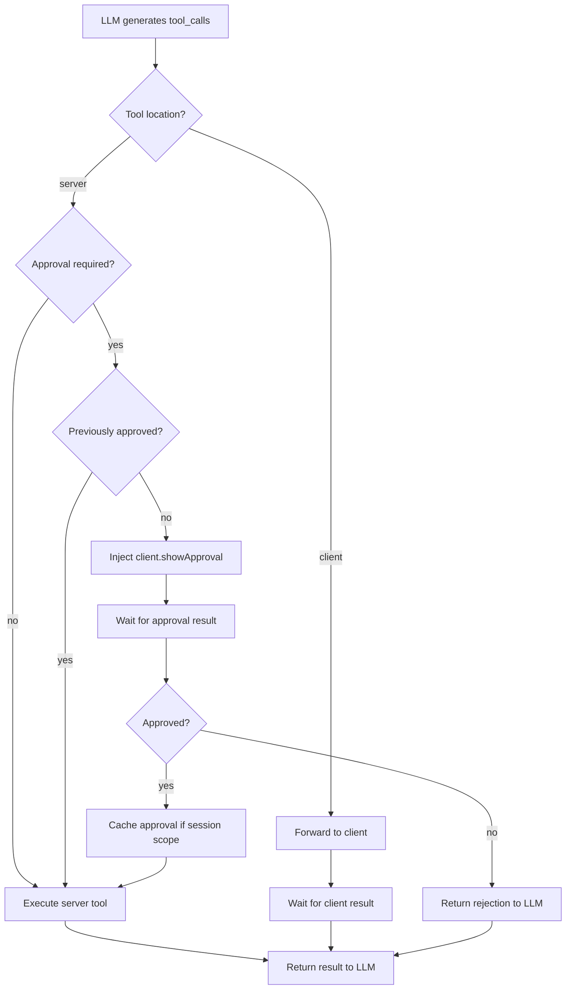

# Requirement: Tool Execution Approval Process

**Date:** 2025-11-03  
**Status:** Draft  
**Priority:** High

---

## Overview

Implement a unified approval process for tool execution that maintains compatibility with standard OpenAI/MCP tool-calling protocols. The system must support both server-side and client-side tool execution while enabling fine-grained approval controls without introducing custom message formats or roles.

---

## Business Goals

1. **User Control**: Give users explicit control over potentially sensitive or destructive operations (e.g., file system access, command execution)
2. **Security**: Prevent unauthorized or unintended tool executions
3. **User Experience**: Minimize approval friction through session-based approval caching
4. **Standards Compliance**: Maintain compatibility with existing tool-call standards (OpenAI, MCP)

---

## Functional Requirements

### FR-1: Unified Tool-Call Schema

**What**: All agent actions must use the standard `assistant.tool_calls` and `tool` message format.

**Details**:
- No custom message roles or types may be introduced
- Both server-side and client-side tools share identical structure:
  ```json
  {
    "role": "assistant",
    "tool_calls": [{
      "id": "uuid",
      "type": "function",
      "function": { 
        "name": "tool.name", 
        "arguments": "{...}" 
      }
    }]
  }
  ```
- Tool results use standard format:
  ```json
  {
    "role": "tool",
    "tool_call_id": "uuid",
    "content": "{\"result\": ...}"
  }
  ```

**Why**: Ensures interoperability with existing LLM providers and tools, reduces complexity.

---

### FR-2: Tool Classification and Registry

**What**: Each tool must declare its execution location and approval requirements.

**Details**:
- Tool registry schema must include:
  ```typescript
  {
    name: string;
    location: "server" | "client";
    approval?: {
      required: boolean;
      pattern?: string;  // regex pattern for auto-approval
      scope?: "once" | "session" | "always";
    };
    // ... existing fields
  }
  ```

**Examples**:
- `shell.executeCommand`: `location: "server"`, `approval.required: true`, `scope: "session"`
- `file.read`: `location: "server"`, `approval.required: false`
- `ui.showNotification`: `location: "client"`, `approval.required: false`

**Why**: Provides declarative configuration for approval behavior without hardcoding logic.

---

### FR-3: Client-Side Approval Tool

**What**: Approval requests must be implemented as a special client-side tool call.

**Details**:
- Tool name: `client.showApproval`
- Parameters:
  ```typescript
  {
    toolName: string;
    toolArguments: object;
    message?: string;  // optional user-facing description
    scope?: "once" | "session" | "always";
  }
  ```
- Client implementation displays approval UI and returns:
  ```json
  {
    "role": "tool",
    "tool_call_id": "approval_uuid",
    "content": "{\"approved\": true, \"scope\": \"session\"}"
  }
  ```

**Why**: Treats approval as a standard tool, maintaining protocol consistency.

---

### FR-4: Server-Side Execution Flow

**What**: Server must intercept, route, and potentially inject approval tool calls.

**Details**:

**Flow Diagram**:


**Execution Steps**:
1. Server receives `assistant.tool_calls` from LLM
2. For each tool call:
   - Check tool registry for `location` and `approval` config
   - **If server tool with approval required:**
     - Check session approval cache
     - If not cached: inject `client.showApproval` tool call to client
     - Wait for approval tool result
     - If approved and scope="session": cache approval
     - Execute original tool if approved
   - **If server tool without approval:** execute directly
   - **If client tool:** forward tool call to client
3. Collect all tool results
4. Return as `tool` messages to LLM

**Why**: Centralizes approval logic while maintaining standard message flow.

---

### FR-5: Session-Based Approval Caching

**What**: Approved actions within a session scope should not require re-approval.

**Details**:
- Cache structure:
  ```typescript
  {
    chatId: string;
    approvals: {
      [toolName: string]: {
        scope: "session" | "once";
        pattern?: string;
        timestamp: number;
      }
    }
  }
  ```
- Cache keying:
  - `scope: "once"`: Clear after single use
  - `scope: "session"`: Clear when chat ends or user explicitly revokes
  - `scope: "always"`: Never require approval (config-level setting)
- Pattern matching for argument-specific approvals (e.g., approve all reads from `/safe/dir/**`)

**Why**: Improves UX by reducing approval fatigue for repeated operations.

---

### FR-6: Security and Validation

**What**: Prevent LLM manipulation and ensure safe execution.

**Details**:

**Security Controls**:
1. **Tool Call Injection Prevention**:
   - LLM cannot directly invoke `client.*` tools
   - Server must be sole authority for injecting approval requests
   
2. **Validation**:
   - All tool arguments must be validated against schema before execution
   - Tool results must be sanitized before returning to LLM
   
3. **Rejection Handling**:
   - If user denies approval, return clear error as tool result:
     ```json
     {
       "role": "tool",
       "tool_call_id": "uuid",
       "content": "{\"error\": \"User denied approval for shell.executeCommand\"}"
     }
     ```
   
4. **Audit Logging**:
   - Log all approval requests and decisions
   - Include: timestamp, tool name, arguments, approval decision, user/session ID

**Why**: Ensures system cannot be bypassed or manipulated by adversarial prompts.

---

## Non-Functional Requirements

### NFR-1: Performance
- Approval injection must add <50ms latency to tool execution path
- Approval cache lookups must be <5ms

### NFR-2: Backward Compatibility
- Existing tools without approval config must continue working unchanged
- Default behavior: `approval.required: false`

### NFR-3: Client Implementation Flexibility
- Multiple client implementations (web, CLI, TUI) can implement approval UI differently
- Client must handle unknown tools gracefully (default deny or prompt)

---

## Out of Scope

1. **Cross-session approval persistence**: Approvals do not persist across chat sessions (future enhancement)
2. **Role-based approval policies**: No user role or permission system in v1
3. **Tool execution quotas or rate limiting**: Separate concern
4. **Asynchronous approval workflows**: All approvals are synchronous (blocking)
5. **Pattern-based auto-approval**: Deferred to v2 due to security complexity
6. **Multi-user approval workflows**: Single user approval only in v1

---

## Constraints and Limitations

### Technical Constraints

1. **Approval Timeout**: Maximum 30 seconds per approval request (configurable)
   - After timeout, tool execution is denied
   - LLM receives timeout error and can retry

2. **Concurrent Approvals**: Limited to 1 approval dialog at a time per user
   - Additional requests queued
   - Queue indicator shown in UI

3. **Streaming Limitation**: Approval requests pause streaming responses
   - SSE event: `approval-required`
   - Client must handle pause/resume flow
   - Non-streaming mode recommended for critical tools

4. **Client Compatibility**: Clients must declare approval support
   - Legacy clients without support will receive errors
   - Graceful degradation: auto-deny or block execution

5. **Conversation Context**: Limited to 10 most recent messages in snapshot
   - Balance between context preservation and memory usage
   - Sufficient for most approval scenarios

### Functional Limitations

1. **No Partial Approval**: All-or-nothing per tool call
   - Cannot approve with modified arguments
   - User must deny and ask LLM to retry with changes

2. **Cache Scope**: Session-only, no persistence
   - Cache cleared when chat ends
   - Cache cleared when user explicitly revokes

3. **Audit Logging**: Local only, no centralized audit trail
   - Sufficient for single-user scenarios
   - Enterprise audit requirements need separate implementation

4. **Security**: No encryption of approval decisions
   - Decisions stored in memory only
   - Transmission over existing channels (no additional security layer)

---

## Example Scenarios

### Scenario 1: First-time Shell Command Execution

1. **User**: "List files in my Downloads folder"
2. **LLM**: Generates `shell.executeCommand` tool call
3. **Server**: 
   - Detects approval required
   - No session cache exists
   - Injects `client.showApproval` tool call
4. **Client**: Shows approval dialog with command details
5. **User**: Approves with "session" scope
6. **Client**: Returns approval result
7. **Server**: 
   - Caches approval for session
   - Executes shell command
   - Returns output to LLM
8. **LLM**: Responds with file list to user

### Scenario 2: Subsequent Shell Command (Same Session)

1. **User**: "Now search for .txt files"
2. **LLM**: Generates `shell.executeCommand` tool call
3. **Server**: 
   - Detects approval required
   - Finds session cache approval
   - Executes command directly (no approval prompt)
4. **LLM**: Returns results

### Scenario 3: User Denies Approval

1. **User**: "Delete all files in my Documents"
2. **LLM**: Generates `shell.executeCommand` tool call
3. **Server**: Injects approval request
4. **Client**: Shows approval dialog
5. **User**: Denies
6. **Client**: Returns `{"approved": false}`
7. **Server**: Returns error tool result to LLM
8. **LLM**: "I cannot execute that command without your approval. Would you like to try a safer approach?"

---

## Success Criteria

1. ✅ All tool executions follow standard OpenAI/MCP message format
2. ✅ Server-side tools can require approval without client awareness
3. ✅ Client can display approval UI for any tool
4. ✅ Session-scoped approvals reduce repeated prompts
5. ✅ System cannot be bypassed via prompt engineering
6. ✅ Existing functionality remains unchanged when approval not configured

---

## Dependencies

- **Core**: Tool registry system (`core/managers.ts`)
- **Server**: Message handling pipeline (`server/api.ts`)
- **Client**: UI components for approval (web/TUI/CLI)
- **Storage**: Session state management for approval cache

---

## Risks and Mitigations

| Risk | Impact | Mitigation |
|------|--------|-----------|
| LLM confused by injected approval calls | High | Clear documentation in system prompts about approval flow |
| Approval fatigue from over-prompting | Medium | Default to session-scoped approvals; pattern-based auto-approval |
| Client doesn't support approval UI | High | Fallback to deny by default; client capability negotiation |
| Session cache memory leak | Low | Implement cache TTL and size limits |

---

---

## Future Enhancements

1. **Persistent Approval Policies**: Save user preferences across sessions
2. **Approval Delegation**: Allow certain agents to auto-approve specific tools
3. **Approval Analytics**: Show users statistics on tool usage and approvals
4. **Conditional Approval**: Pattern-based rules (e.g., "approve all reads, deny all writes")
5. **Approval Timeout**: Auto-deny if no response within N seconds

---

## Architecture Review (2025-11-03)

### Critical Findings

#### ✅ CORRECTED: Conversation Context with Filtering (SOLVES THE ISSUE)

**Original Concern**: Injecting `client.requestApproval` tool calls pollutes LLM conversation.

**Revised Analysis**: **Two-Layer Approach: Store Everything, Filter for LLM**

**CRITICAL DISTINCTION**:
1. **Agent Memory (Storage Layer)**: ALL tool calls saved, including `client.*`
2. **LLM Input (Processing Layer)**: Filter out `client.*` tools before sending

**Why Store Client Tool Calls in Memory?**
- **Conversation Continuity**: When resuming chat, client knows what approvals were given
- **Audit Trail**: Full history of all operations, including approval decisions
- **State Reconstruction**: Can rebuild exact conversation state from storage
- **Multi-Turn Context**: Client-side tools are part of the conversation flow

**Why Filter Before LLM?**
- **LLM Focus**: LLM only needs to see domain-relevant conversation
- **Clean Context**: Approval mechanics are infrastructure, not conversation content
- **Token Efficiency**: Don't waste tokens on approval protocol

**The Flow**:

1. **Server injects approval request** (saved to memory):
```typescript
// During streaming in openai-direct.ts
const assistantMessage = {
  role: 'assistant',
  content: '',
  tool_calls: [{
    id: 'approval_123',
    function: { name: 'client.requestApproval', arguments: '...' }
  }]
};

// SAVED to agent.memory
agent.memory.push(assistantMessage);
await storage.saveAgent(world.id, agent);
```

2. **Client executes approval request** (result saved to memory):
```typescript
// Client adds tool result to messages[]
const toolResult = {
  role: 'tool',
  tool_call_id: 'approval_123',
  content: JSON.stringify({ decision: 'approve', scope: 'session' })
};

// SAVED to agent.memory via processAgentMessage
agent.memory.push(toolResult);
await storage.saveAgent(world.id, agent);
```

3. **Server filters when preparing for LLM** (in openai-direct.ts):
```typescript
// Convert agent.memory to LLM messages
function prepareMessagesForLLM(agent: Agent): ChatMessage[] {
  return agent.memory
    .filter(msg => {
      // Remove client tool calls
      if (msg.role === 'assistant' && msg.tool_calls) {
        msg.tool_calls = msg.tool_calls.filter(tc => 
          !tc.function.name.startsWith('client.')
        );
        // Keep message if it has content or remaining tool calls
        return msg.content || msg.tool_calls.length > 0;
      }
      // Remove client tool results
      if (msg.role === 'tool' && msg.tool_call_id?.startsWith('approval_')) {
        return false;
      }
      return true;
    });
}

// Use filtered messages for LLM
const llmMessages = prepareMessagesForLLM(agent);
const response = await llm.chat(llmMessages);
```

**Result**: 
- ✅ **Memory**: Complete conversation history with ALL tool calls
- ✅ **LLM Input**: Clean conversation without approval infrastructure
- ✅ **Client Continuity**: Can rebuild state from stored messages
- ✅ **No Context Pollution**: LLM never sees approval mechanics

**This is the CORRECT approach** - store everything, filter selectively.

---

#### ✅ CORRECTED: Message-Based Flow Eliminates Streaming Pause Problem

**Original Concern**: Need to pause/resume EventEmitter streaming for approval.

**Revised Analysis**: **No pause/resume needed** - approval happens via message-based flow.

**How It Actually Works**:

**Phase 1: Initial Streaming** (approval request)
```typescript
// Server streams until approval needed
for await (const chunk of llmStream) {
  publishSSE(world, { type: 'chunk', content: delta });
  
  if (toolCallDetected && requiresApproval) {
    // Inject client.requestApproval tool call
    publishSSE(world, {
      type: 'chunk',
      tool_calls: [{
        function: { name: 'client.requestApproval', ... }
      }]
    });
    
    // End streaming naturally (SSE stream completes)
    publishSSE(world, { type: 'end' });
    break;
  }
}
```

**Phase 2: User Approval** (client-side, no server state)
```typescript
// Client shows UI, user clicks "Approve"
// Client adds approval result to messages[]
messages.push({
  role: 'tool',
  tool_call_id: 'approval_123',
  content: JSON.stringify({ decision: 'approve', scope: 'session' })
});
```

**Phase 3: Resume via New Request** (stateless)
```typescript
// Client POSTs messages to server
fetch('/worlds/my-world/messages', {
  method: 'POST',
  body: JSON.stringify({
    message: originalMessage,  // Same message
    messages: messagesWithApproval  // Includes approval result
  })
});

// Server extracts approval, updates cache, processes message
// NEW SSE stream starts for continued response
```

**Why This Works**:
- ✅ **No Pause/Resume**: Each phase is separate SSE stream
- ✅ **No Server State**: Approval decision in messages[], not server memory
- ✅ **Natural Flow**: SSE stream ends, client decides next action, new stream starts
- ✅ **Multi-Client Safe**: Each client manages own message history
- ✅ **Works with EventEmitter**: No modifications to event system needed

**Key Insight**: The "pause" happens naturally when SSE stream ends. The "resume" is just a new POST /messages request with approval included.

**This is how modern chat UIs work** (ChatGPT, Claude, etc.) - each user action is a new request with full conversation context.

---

#### ❌ CRITICAL FLAW 3: Tool Location Design

**Problem**: The `location: "server" | "client"` design assumes client can execute tools, but current architecture has NO client-side tool execution capability.

**Current Architecture**:
- All tools execute server-side via MCP registry
- Clients are passive event listeners (SSE, WebSocket)
- No mechanism for server to request client action and wait for response

**From code analysis**:
```typescript
// mcp-server-registry.ts - ALL tool execution is server-side
export async function executeMCPTool(worldId: string, toolName: string, args: any) {
  // Server-side MCP client execution only
}

// No client-side tool registry or execution framework exists
```

**Impact**: HIGH - Requires building entire client-side tool execution framework

**Alternatives**:
1. **Approval as UI-Only**: Client shows UI, returns decision via API call (not a "tool")
2. **Server-Side Approval Cache**: Pre-configure approvals in world settings
3. **Blocking API**: Client polls for approval status (simpler than tool framework)

---

#### ✅ Tool Definition Extension (CORRECT APPROACH)

**Original Concern**: New `ToolRegistry` class duplicates existing MCP functionality.

**Revised Analysis**: We should **extend existing tool structure** in `mcpToolsToAiTools()`, not create new registry.

**Current Tool Structure** (from `mcp-server-registry.ts`):
```typescript
// Line 930: aiTools object structure
aiTools[key] = {
  description: enhancedDescription,
  parameters: finalSchema,
  execute: async (args, sequenceId, parentToolCall) => {
    // MCP tool execution
  }
};
```

**Extended Tool Structure** (add approval metadata):
```typescript
aiTools[key] = {
  description: enhancedDescription,
  parameters: finalSchema,
  
  // NEW: Approval configuration
  location: 'server',  // or 'client'
  approval: {
    required: true,
    message: 'Execute shell command: {command}',  // Template for UI
    options: ['Cancel', 'Once', 'Always']         // UI buttons
  },
  
  execute: async (args, sequenceId, parentToolCall) => {
    // Check approval cache before execution
    if (this.approval?.required) {
      const cache = getApprovalCache();
      const approved = cache.get(currentChatId, toolName);
      
      if (!approved) {
        // Throw exception to trigger approval request injection
        throw new ApprovalRequiredException({
          toolName,
          toolArgs: args,
          message: this.approval.message,
          options: this.approval.options
        });
      }
    }
    
    // Normal MCP tool execution
    return await executeMCPTool(...);
  }
};
```

**Implementation Strategy**:
1. Add `location` and `approval` fields to tool definitions in `mcpToolsToAiTools()`
2. Modify tool `execute()` wrapper to check approval cache
3. Throw `ApprovalRequiredException` when approval needed
4. Catch exception in LLM provider code, inject `client.requestApproval` tool call
5. Server filters `client.*` tools from messages before sending to LLM

**No New Classes Needed**: Just extend existing tool object structure

---

#### ✅ Three-Tier Scope Design (GOOD)

**Original Concern**: Three-tier scope system (`once`, `session`, `always`) adds complexity.

**Revised Analysis**: The three-tier scope is actually **good design** for approval management:

1. **Cancel (Deny)**: Explicit rejection, tool execution blocked
   - Use case: User wants to prevent dangerous operation
   - Behavior: Tool returns error to LLM, LLM tries alternative approach
   - Persistence: Not cached (each attempt requires approval)

2. **Once (Approve for this execution)**: Temporary approval for single use
   - Use case: User wants to approve this specific operation only
   - Behavior: Tool executes, approval not cached
   - Persistence: None - next tool call requires approval again

3. **Always (Approve for session)**: Session-scoped approval caching
   - Use case: User trusts this tool for the current chat session
   - Behavior: Tool executes, approval cached with `chatId` key
   - Persistence: Until chat ends or user explicitly revokes
   - Implementation: Simple `Map<chatId, Map<toolName, approval>>`

**Why This Works**:
- **Clear User Intent**: Three options map directly to user mental models
- **Simple Persistence**: Session scope = current chat (already tracked)
- **No TTL Complexity**: Cache cleared when chat ends (existing lifecycle)
- **Progressive Trust**: User can start with "Once", upgrade to "Always"

**Implementation in Message Flow**:
```typescript
// Client tool result includes scope
{
  role: 'tool',
  tool_call_id: 'approval_123',
  content: JSON.stringify({
    decision: 'approve',  // or 'deny'
    scope: 'session'      // or 'once' (no cache)
  })
}

// Server processes on POST /messages
if (decision === 'approve' && scope === 'session') {
  approvalCache.set(chatId, toolName, { approved: true });
}
// If scope === 'once', don't cache
```

---

### Confirmed Architecture: Message-Based Approval Flow

**This is the CORRECT approach from the original plan**, with clarifications on filtering and message flow.

#### Architecture Diagram

```
┌────────────────────────────────────────────────────────┐
│ Phase 1: Initial Request & Approval Detection               │
├────────────────────────────────────────────────────────┤
│ 1. Client: POST /messages { message: "delete all files" }     │
│ 2. Server: Streams to LLM via openai-direct.ts                │
│ 3. LLM: Generates tool_call for shell_cmd                     │
│ 4. Server: Detects tool requires approval (ApprovalException) │
│ 5. Server: Injects client.requestApproval tool call           │
│ 6. Server: Streams approval request via SSE                   │
│ 7. Server: Ends SSE stream (type: 'end')                      │
├────────────────────────────────────────────────────────┤
│ Phase 2: User Decision (Client-Side, No Server Involvement)   │
├────────────────────────────────────────────────────────┤
│ 8. Client: Shows approval dialog (Cancel/Once/Always)         │
│ 9. User: Clicks "Always" (approve for session)               │
│ 10. Client: Adds tool result to messages[]                   │
│     { role: 'tool', tool_call_id: 'approval_123',             │
│       content: '{"decision": "approve", "scope": "session"}' }  │
├────────────────────────────────────────────────────────┤
│ Phase 3: Resume with Approval (New Request, Stateless)        │
├────────────────────────────────────────────────────────┤
│ 11. Client: POST /messages with approval result in messages[] │
│ 12. Server: Extracts approval decision from messages[]        │
│ 13. Server: Updates approval cache (chatId + toolName)        │
│ 14. Server: Filters client.* tools from messages[]            │
│ 15. Server: Sends cleaned messages to agent/LLM                │
│ 16. Agent: Processes message (LLM never saw approval flow)    │
│ 17. LLM: Generates same tool call (shell_cmd)                 │
│ 18. Server: Checks cache, finds approval, executes tool       │
│ 19. Server: Streams tool result + response via SSE            │
│ 20. Client: Displays response                                 │
└────────────────────────────────────────────────────────┘
```

#### Key Implementation Points

**1. Tool Definition Extension** (in `mcpToolsToAiTools()`):
```typescript
aiTools[key] = {
  description: enhancedDescription,
  parameters: finalSchema,
  location: 'server',  // NEW
  approval: {          // NEW
    required: true,
    message: 'Execute shell command: {command}',
    options: ['Cancel', 'Once', 'Always']
  },
  execute: async (args) => {
    // Check cache, throw ApprovalRequiredException if needed
  }
};
```

**2. Approval Request Injection** (in `openai-direct.ts`):
```typescript
try {
  const result = await tool.execute(args);
} catch (error) {
  if (error instanceof ApprovalRequiredException) {
    // Inject client.requestApproval tool call
    const approvalToolCall = {
      id: `approval_${generateId()}`,
      function: {
        name: 'client.requestApproval',
        arguments: JSON.stringify({
          originalToolCall: { name: toolName, args },
          message: error.message,
          options: error.options
        })
      }
    };
    
    // Stream to client
    publishSSE(world, {
      type: 'chunk',
      tool_calls: [approvalToolCall]
    });
    
    // CRITICAL: Save to agent.memory for conversation continuity
    const assistantMessage = {
      role: 'assistant',
      content: '',
      tool_calls: [approvalToolCall]
    };
    agent.memory.push(assistantMessage);
    await storage.saveAgent(world.id, agent);
    
    // End stream, let client handle
    publishSSE(world, { type: 'end' });
    return;
  }
  throw error;
}
```

**3. Message Filtering for LLM** (in `openai-direct.ts` prepareMessagesForLLM):
```typescript
// IMPORTANT: This filtering is ONLY for LLM input preparation
// ALL messages (including client.*) are ALREADY SAVED in agent.memory

function prepareMessagesForLLM(agent: Agent): ChatMessage[] {
  // Start with complete agent.memory (includes client.* tools)
  const allMessages = [...agent.memory];
  
  // Filter OUT client.* tools when preparing for LLM
  return allMessages.filter(msg => {
    // Filter assistant messages with client tool calls
    if (msg.role === 'assistant' && msg.tool_calls) {
      // Remove client.* tool calls from the list
      msg.tool_calls = msg.tool_calls.filter(tc => 
        !tc.function.name.startsWith('client.')
      );
      // Keep message if it has content or remaining (non-client) tool calls
      return msg.content || msg.tool_calls.length > 0;
    }
    
    // Filter client tool results
    if (msg.role === 'tool' && msg.tool_call_id?.startsWith('approval_')) {
      return false;  // Don't send approval results to LLM
    }
    
    // Keep all other messages
    return true;
  });
}

// Use filtered messages ONLY for LLM call
const llmMessages = prepareMessagesForLLM(agent);
const conversationMessages = convertMessagesToOpenAI(llmMessages);
const response = await openai.chat.completions.create({
  messages: conversationMessages  // Clean messages, no client.* tools
});
```

**Key Points**:
- ✅ **agent.memory** contains ALL messages (including client.* tools)
- ✅ **Filtering** happens only when preparing input for LLM
- ✅ **Storage** is complete and unfiltered for full audit trail
- ✅ **LLM** sees clean conversation without approval infrastructure

**4. Approval Cache** (simple implementation):
```typescript
// core/approval-cache.ts
class ApprovalCache {
  private cache = new Map<string, Map<string, { approved: boolean, timestamp: number }>();
  
  set(chatId: string, toolName: string, approval: { approved: boolean }) {
    if (!this.cache.has(chatId)) {
      this.cache.set(chatId, new Map());
    }
    this.cache.get(chatId)!.set(toolName, {
      approved: approval.approved,
      timestamp: Date.now()
    });
  }
  
  get(chatId: string, toolName: string): { approved: boolean } | undefined {
    return this.cache.get(chatId)?.get(toolName);
  }
  
  clearChat(chatId: string) {
    this.cache.delete(chatId);
  }
}
```

---

### Specific Technical Issues

#### Issue 1: EventEmitter Listener Cleanup

**Current Pattern** (from `server/api.ts`):
```typescript
const listeners = new Map<string, (...args: any[]) => void>();
world.eventEmitter.on('sse', listener);
listeners.set('sse', listener);

// Cleanup on stream end
listeners.forEach((listener, event) => {
  world.eventEmitter.off(event, listener);
});
```

**Approval Impact**: If approval pauses stream, listener cleanup must be delayed, but timeout logic may fire and cleanup listeners prematurely.

---

#### Issue 2: Multi-Agent Concurrency

**Current Architecture**: Multiple agents can process simultaneously in same world.

**Approval Problem**: If Agent A requests approval while Agent B is executing, how does UI handle?

**Current Code** (no agent-level locking):
```typescript
// No mechanism to pause specific agent while waiting for approval
// All agents share same world.eventEmitter
```

**Recommendation**: Queue approval requests per-agent, not per-world

---

#### Issue 3: Tool Arguments in Approval UI

**Security Risk**: Displaying full tool arguments may expose sensitive data (API keys, passwords, etc.)

**Example**:
```json
{
  "tool": "api_call",
  "args": {
    "url": "https://api.example.com",
    "headers": {
      "Authorization": "Bearer sk-xxxxx"  // SENSITIVE!
    }
  }
}
```

**Recommendation**: Sanitize arguments before showing in UI

---

### Updated Recommendations

#### Architecture Is Sound (Keep Original Plan Approach)

1. ✅ **Client-Side Tool Injection**: Use `client.requestApproval` tool calls
2. ✅ **Message-Based Flow**: Everything flows through POST /messages
3. ✅ **Filtering Layer**: Server removes `client.*` tools before LLM
4. ✅ **Three-Tier Scope**: Cancel/Once/Always maps to user intent
5. ✅ **Session-Scoped Cache**: Simple `Map<chatId, Map<toolName, approval>>`

#### Implementation Refinements

1. **Extend MCP Tool Structure** (not new registry):
   ```typescript
   // In mcpToolsToAiTools(), add to each tool:
   aiTools[key] = {
     ...existingFields,
     location: 'server' | 'client',
     approval: { required, message, options }
   };
   ```

2. **Approval Cache** (simple):
   ```typescript
   // Keyed by chatId (existing world.currentChatId)
   approvalCache.set(chatId, toolName, { approved: true });
   ```

3. **Filter in POST /messages**:
   ```typescript
   // Extract approval decisions from messages[]
   // Update cache
   // Remove client.* tools before agent processing
   ```

4. **Tool Execute Wrapper**:
   ```typescript
   execute: async (args) => {
     if (approval?.required && !cache.get(chatId, toolName)) {
       throw new ApprovalRequiredException({...});
     }
     return await executeMCPTool(...);
   }
   ```

#### What Needs Clarification in Original Plan

1. **Emphasize Message-Based Flow**: Make it clear that approval doesn't require server-side session tracking
2. **Document Filtering**: Explain how `client.*` tools are removed before LLM sees them
3. **Simplify Phases**: Some phases in original plan are too granular
4. **Remove "Interceptor" Terminology**: It's just exception handling + injection

#### Don't Change These (From Original Plan)

1. ✅ Client-side tool concept (it works!)
2. ✅ Injection of approval requests (filtered properly)
3. ✅ Three-tier scope system (good UX)
4. ✅ Tool call filtering before LLM

#### Do Change These

1. ❌ Remove "Tool Interceptor" class (just use try/catch)
2. ❌ Remove "ToolRegistry" class (extend MCP tool structure)
3. ❌ Simplify streaming pause/resume (just end stream, new request resumes)
4. ❌ Clarify message-based flow (no server session state)

---

### Success Criteria (Revised)

1. ✅ User can approve/deny tool execution via UI
2. ✅ Approved tools cached per chat session
3. ✅ No breaking changes to existing streaming flow
4. ✅ Works with CLI, Web, and TUI clients
5. ✅ <100ms overhead for cached approvals
6. ✅ LLM conversation context remains clean (filtered for LLM input)
7. ✅ Complete conversation history stored in agent.memory (including approval flow)
8. ✅ Client can reconstruct conversation state from storage

---

## Final Architecture Review (2025-11-03)

### ✅ APPROVED FOR IMPLEMENTATION

After comprehensive review and clarification of key implementation details, this architecture is **ready for implementation** with the following validated design:

**Two-Layer Architecture** (Storage vs Processing):
1. **Storage Layer** (`agent.memory`): ALL messages saved, including `client.*` tool calls
   - Purpose: Complete audit trail, conversation continuity, state reconstruction
   - Implementation: `agent.memory.push()` + `storage.saveAgent()`
   
2. **Processing Layer** (`prepareMessagesForLLM()`): Filter `client.*` tools before LLM
   - Purpose: Clean LLM input, reduced tokens, invisible approval infrastructure
   - Implementation: Filter function applied before LLM API call

**Core Architectural Principles**:
- ✅ **Message-Based Flow**: Approval decisions travel through POST /messages (stateless server)
- ✅ **Client-Side Tool Injection**: Use `client.requestApproval` tool calls (filtered for LLM)
- ✅ **Three-Tier Scope**: Cancel/Once/Always maps to user intent
- ✅ **Session-Scoped Cache**: Simple `Map<chatId, toolName>` cleared on chat end
- ✅ **Extend Existing Tools**: Add `location` and `approval` fields to MCP tool structure

**Implementation Verification Points**:
1. Client tool calls MUST be saved to `agent.memory` (line ~711 in events.ts pattern)
2. Client tool results MUST be saved to `agent.memory` (line ~874 in events.ts pattern)
3. Filtering MUST happen in `prepareMessagesForLLM()` before OpenAI API call
4. Approval cache MUST be session-scoped (keyed by `world.currentChatId`)
5. Tool structure extension MUST be in `mcpToolsToAiTools()` (no new registry)

**Risk Assessment**: LOW
- Compatible with existing event-driven architecture
- No streaming pause/resume needed (natural SSE end/start)
- No conversation context pollution (filtering layer)
- No server-side session tracking (message-based)
- No breaking changes to existing APIs

**Estimated Effort**: 30 hours (7 phases)
**Complexity**: Medium (requires careful coordination of storage and filtering)
**Confidence**: High (all concerns addressed, clear implementation path)

````
