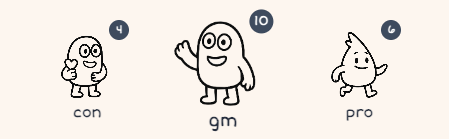

# Agent World

*Build AI agent teams with just words—no coding required.*

## Why Agent World?

Traditional AI frameworks force you to write hundreds of lines of code just to make agents talk to each other. Agent World lets you create intelligent agent teams using nothing but plain natural language.

Audio introduction: [Listen here](https://yysun.github.io/agent-world)

**Other frameworks:**
- Install SDKs → write code → handle loops → deploy containers
- Learn Python/TypeScript before "Hello, world"

**Agent World:**
- Write prompts → for multiple agents → communicating in a shared world
```text
You are @moderator. When someone says "start debate", 
ask for a topic, then tag @pro and @con to argue.
```
Paste that prompt. Agents come alive instantly.



## Why It Works

- ✅ No Code Required - Agents are defined entirely in natural language
- ✅ Natural Communication - Agents understand context and conversations
- ✅ Built-in Rules for Messages - Turn limits to prevent loops
- ✅ Multiple AI Providers - Use different models for different agents
- ✅ Modern Web Interface - React + Next.js frontend with real-time chat

## What You Can Build

- Debate Club
```text
@moderator: Manages rounds, keeps time
@pro: Argues for the topic  
@con: Argues against the topic
```

- Editorial Pipeline
```text
@planner: Assigns articles
@author: Writes drafts
@editor: Reviews and edits
@publisher: Formats and publishes
```

- Game Master
```text
@gm: Runs the game, manages state
@player1, @player2: Take turns
@assistant: Helps with rules
```

- Social Simulation
```text
@alice: Friendly neighbor
@bob: Practical problem-solver  
@charlie: Creative dreamer
```

- Customer Support
```text
@triage: Categorizes requests
@specialist: Handles technical issues
@manager: Escalates complaints
```

## How Agents Communicate

Each Agent World has a collection of agents that can communicate through a shared event system. Agents follow simple rules:

### Message Rules

| Message Type | Example | Who Responds |
|--------------|---------|--------------|
| **Human message** | `Hello everyone!` | All active agents |
| **Direct mention** | `@alice Can you help?` | Only @alice |
| **Paragraph mention** | `Please review this:\n@alice` | Only @alice |
| **Mid-text mention** | `I think @alice should help` | Nobody (saved to memory) |

### Agent Behavior

**Agents always respond to:**
- Human messages (unless mentioned agents exist)
- Direct @mentions at paragraph start
- System messages

**Agents never respond to:**
- Their own messages
- Other agents (unless @mentioned), but will save message to memory
- Mid-text mentions (will save message to memory)

**Turn limits prevent loops:**
- Default: 5 responses per conversation thread
- Agents automatically pass control back to humans
- Configurable per world


## Installation & Setup

### Prerequisites
- Node.js 20+ 
- An API key for your preferred LLM provider

### Quick Start

**Option 1: CLI Interface**
```bash
npx agent-world
```

**Option 2: Web Interface**
```bash
npx agent-world --server
```

## Project Structure (npm workspaces)

This project uses npm workspaces with two main packages:

- **`core/`** - Reusable agent management library
  - World-mediated agent management system
  - Event-driven architecture
  - LLM provider abstraction
  - Cross-platform compatibility (Node.js/Browser)

- **`next/`** - Next.js web application
  - React frontend with Tailwind CSS
  - API routes for CRUD operations
  - Real-time chat with streaming support
  - Modern, minimalistic UI

### Cross-workspace imports
```typescript
// In next/ workspace
import { createWorld, listAgents, publishMessage } from '@agent-world/core';
```

### Web Interface Features

The Next.js workspace provides a modern web interface with:

- **Home Page**: World selector and creator with clean card-based UI
- **World Page**: Chat interface with agent management sidebar
  - Real-time messaging with agents
  - Toggle between streaming and non-streaming modes
  - Agent creation with custom system prompts
  - Responsive design with Tailwind CSS

### API Endpoints

The Next.js workspace exposes REST APIs for integration:

```
GET    /api/worlds                     # List all worlds
POST   /api/worlds                     # Create new world
GET    /api/worlds/:id                 # Get world details
PUT    /api/worlds/:id                 # Update world
DELETE /api/worlds/:id                 # Delete world

GET    /api/worlds/:id/agents          # List agents in world
POST   /api/worlds/:id/agents          # Create new agent
GET    /api/worlds/:id/agents/:agentId # Get agent details
PUT    /api/worlds/:id/agents/:agentId # Update agent
DELETE /api/worlds/:id/agents/:agentId # Delete agent

POST   /api/worlds/:id/chat            # Send message (streaming/non-streaming)
```

### Environment Setup

Export your API keys as environment variables 

```bash
# Required if Choose one or more
export OPENAI_API_KEY="your-key-here"
export ANTHROPIC_API_KEY="your-key-here"  
export GOOGLE_API_KEY="your-key-here"

# Default: For local models
export OLLAMA_BASE_URL="http://localhost:11434"
```

Or create a `.env` file in your working directory with:

```env
OPENAI_API_KEY=your-key-here
ANTHROPIC_API_KEY=your-key-here
GOOGLE_API_KEY=your-key-here
OLLAMA_BASE_URL=http://localhost:11434
```

### World Database Setup

The worlds are stored in the SQLite database under the `~/agent-world` directory. You can change the database path by setting the environment variable `AGENT_WORLD_SQLITE_DATABASE`.

Or, you can change the storage type to file-based by setting the environment variable `AGENT_WORLD_STORAGE_TYPE` to `file`. And set the `AGENT_WORLD_DATA_PATH` to your desired directory.

```bash
# Use file storage
export AGENT_WORLD_STORAGE_TYPE=file
export AGENT_WORLD_DATA_PATH=./data/worlds
```

## Learn More

- **[Building Agents with Just Words](docs/Building%20Agents%20with%20Just%20Words.md)** - Complete guide with examples


## Future Plans

- **Long Run Worlds** - Worlds can run for days or weeks, with agents evolving over time
- **Dynamic Worlds** - Worlds can provide real-time data to agents, e.g. date and time
- **Tools / MCP Support** - Worlds can have tools for agents to use, like search or code execution
- **Agent Learning** - Agents will evolve based on interactions
- **Agent Replication** - Agents can create new agents

## Contributing

Agent World thrives on community examples and improvements:

1. **Share your agent teams** - Submit interesting prompt combinations
2. **Report bugs** - Help us improve the core system  
3. **Suggest features** - What would make agents more useful?
4. **Write docs** - Help others learn faster

## License

MIT License - Build amazing things and share them with the world!

Copyright © 2025 Yiyi Sun


