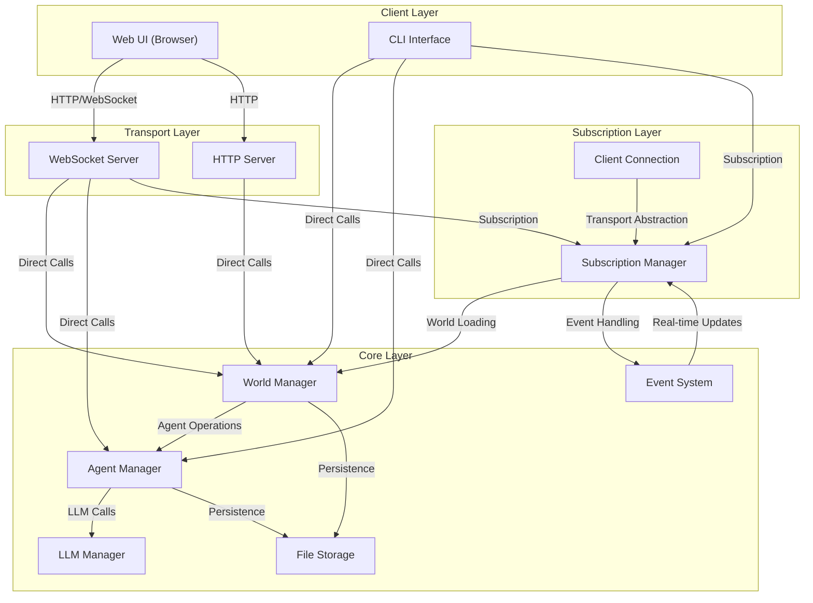
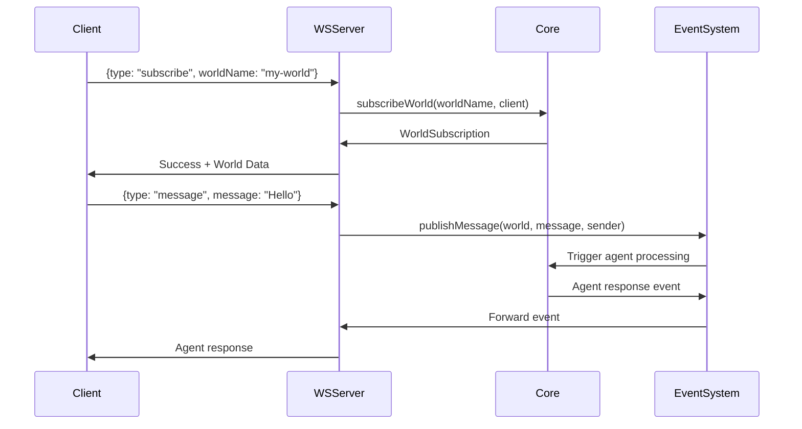
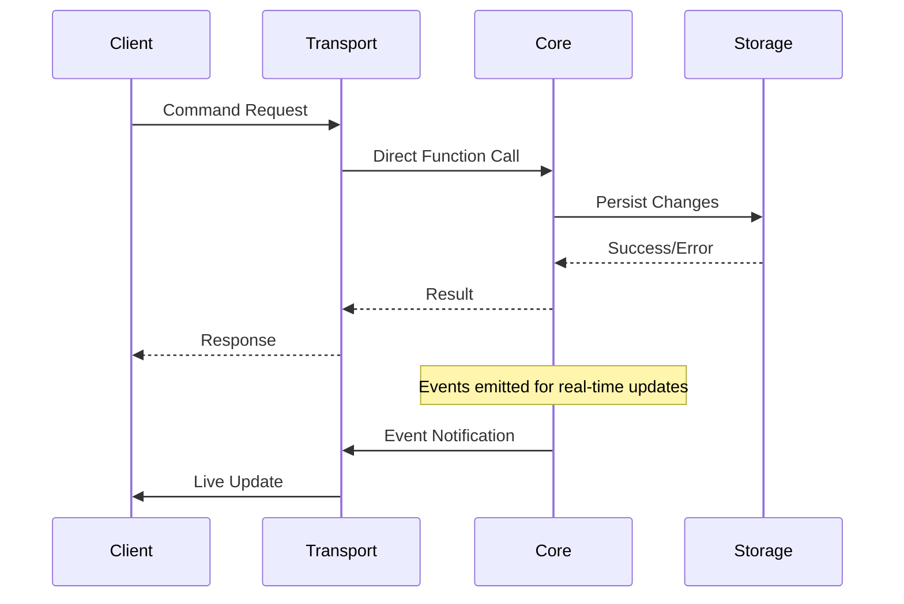
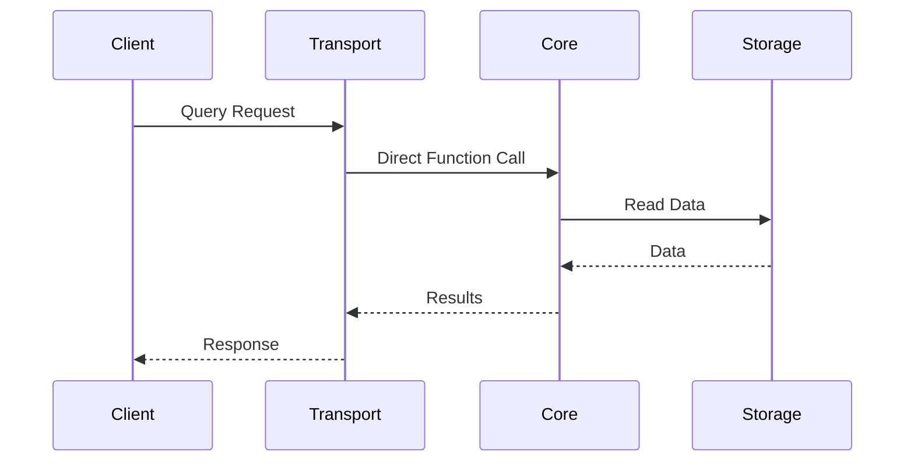
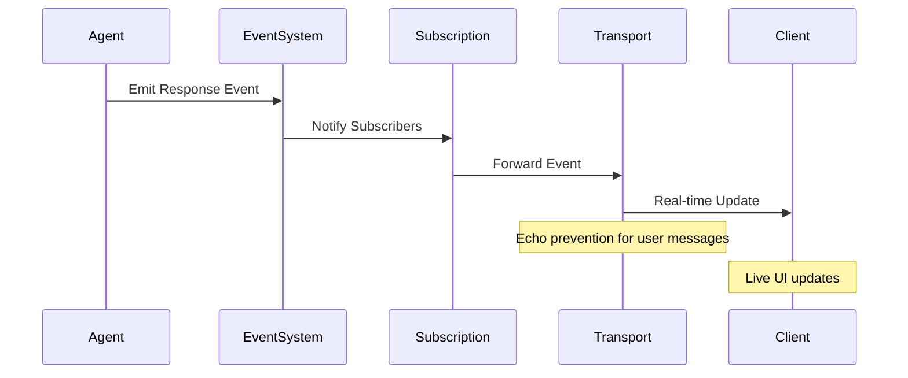
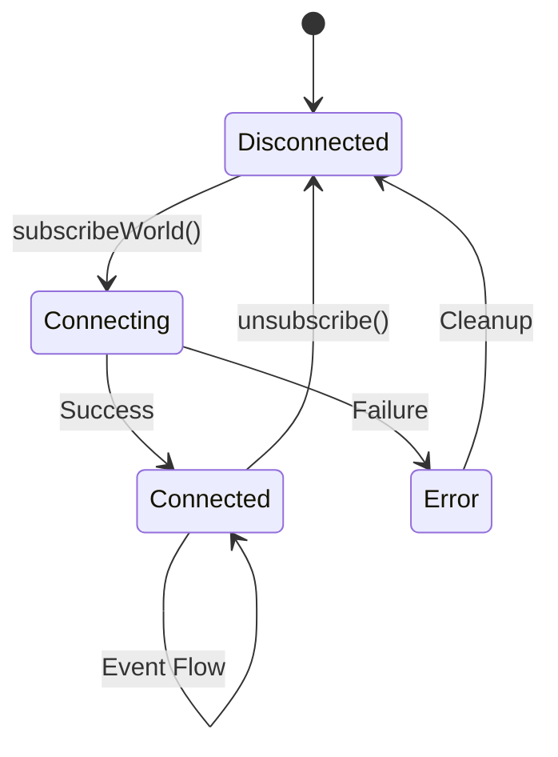
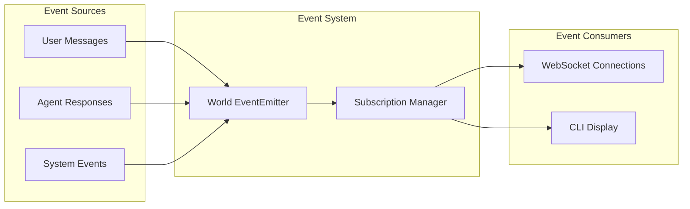

# Agent World Architecture v2.0
*Current Streamlined Design - July 2025*

## Executive Summary

Agent World implements a **streamlined layered architecture** with direct core access, real-time event streaming, and multi-client support. The system has evolved from a complex command processing layer to an efficient direct-access pattern while maintaining clean separation of concerns and transport abstraction.

## 1. Architecture Overview

### 1.1 High-Level Architecture



### 1.2 Architecture Principles

1. **Direct Core Access**: Transport layers call core functions directly for maximum efficiency
2. **Centralized Subscription**: World subscription and event management centralized for code reuse
3. **Transport Abstraction**: ClientConnection interface supports multiple client types
4. **Event-Driven Updates**: Real-time streaming through EventEmitter system
5. **Conditional Compilation**: Core works in both Node.js and browser environments

## 2. Layer Breakdown

### 2.1 Core Layer (`core/`)

The business logic engine providing complete world and agent management.

#### Key Modules:

| Module | Purpose | Key Functions |
|--------|---------|---------------|
| `world-manager.ts` | World lifecycle | `createWorld()`, `getWorld()`, `updateWorld()`, `deleteWorld()`, `listWorlds()` |
| `agent-manager.ts` | Agent lifecycle | `createAgent()`, `getAgent()`, `updateAgent()`, `deleteAgent()`, `clearAgentMemory()` |
| `llm-manager.ts` | LLM integration | Provider abstraction, model configuration |
| `subscription.ts` | Event management | `subscribeWorld()`, `ClientConnection` interface |
| `*-storage.ts` | Persistence | File-based storage for worlds and agents |
| `*-events.ts` | Event system | EventEmitter-based pub/sub for real-time updates |

#### Core Characteristics:
- **Self-contained**: Can run independently without transport layers
- **File-based Storage**: JSON files for persistence with atomic writes
- **EventEmitter Integration**: Real-time event streaming for live updates
- **Type Safety**: Full TypeScript with comprehensive type definitions
- **Browser Compatibility**: Conditional compilation with no-op browser functions

### 2.2 Transport Layer

#### 2.2.1 WebSocket Server (`server/ws.ts`)

**Purpose**: Real-time bidirectional communication for web clients

**Key Features**:
- **Connection Management**: Per-connection world subscription state
- **Message Types**: `subscribe`, `unsubscribe`, `system`, `world`, `message`
- **Command Processing**: Direct core function calls with typed parameters
- **Event Forwarding**: Real-time agent responses and system events
- **Echo Prevention**: Filters user messages to prevent feedback loops

**Message Flow**:


#### 2.2.2 HTTP Server (`server/api.ts`)

**Purpose**: RESTful API for stateless operations (currently minimal)

**Endpoints**:
- `GET /health` - Server health check with WebSocket statistics

### 2.3 Client Layer

#### 2.3.1 CLI Interface (`cli/`)

**Purpose**: Terminal-based interface with both pipeline and interactive modes

**Architecture**:
- **Direct Core Access**: Calls core functions directly for commands
- **Subscription Integration**: Uses subscription layer for world events
- **Dual Mode Operation**: Pipeline (execute and exit) vs Interactive (persistent session)
- **Real-time Streaming**: Live agent responses with streaming display

**Command Processing**:
```typescript
// Direct core function calls
if (input.startsWith('/')) {
  // Command execution
  const result = await processCLICommand(input, context);
  // Direct calls: listWorlds(), getWorld(), world.createAgent()
} else {
  // Message to world
  publishMessage(world, input, sender);
}
```

#### 2.3.2 Web UI (`public/`)

**Purpose**: Browser-based interface with rich interactive components

**Architecture**:
- **AppRun Framework**: Component-based reactive UI
- **WebSocket Integration**: Real-time communication with server
- **State Management**: Local state with WebSocket event synchronization
- **Responsive Design**: Modern web interface with theme support

## 3. Data Flow Patterns

### 3.1 Command Flow (Write Operations)



### 3.2 Query Flow (Read Operations)



### 3.3 Event Flow (Real-time Updates)



## 4. Subscription Management

### 4.1 ClientConnection Interface

**Purpose**: Transport abstraction for event handling

```typescript
interface ClientConnection {
  send: (data: string) => void;
  isOpen: boolean;
  onWorldEvent?: (eventType: string, eventData: any) => void;
  onError?: (error: string) => void;
}
```

### 4.2 World Subscription Lifecycle



**Key Features**:
- **Automatic Cleanup**: Prevents memory leaks on disconnect
- **Event Filtering**: Transport-specific event handling
- **State Management**: Per-connection world references
- **Error Handling**: Graceful failure modes

## 5. Storage Architecture

### 5.1 File-based Persistence

**Structure**:
```
data/worlds/
├── world-id/
│   ├── world.json          # World configuration
│   ├── agents/
│   │   ├── agent-id.json   # Agent configuration
│   │   └── agent-id-memory.json  # Agent conversation history
│   └── metadata.json       # World metadata
```

**Characteristics**:
- **Atomic Writes**: Safe concurrent access
- **JSON Format**: Human-readable and debuggable
- **Hierarchical**: Clear organization by world and agent
- **Separation**: Configuration vs runtime data

### 5.2 Data Models

#### World Model:
```typescript
interface World {
  id: string;
  name: string;
  description?: string;
  turnLimit: number;
  eventEmitter: EventEmitter;  // Runtime only
  agents: Map<string, Agent>;  // Runtime only
  // Methods for agent operations
}
```

#### Agent Model:
```typescript
interface Agent {
  id: string;
  name: string;
  type: 'conversational';
  provider: LLMProvider;
  model: string;
  systemPrompt: string;
  memory: AgentMessage[];     // Conversation history
  metadata: AgentMetadata;
}
```

## 6. Event System

### 6.1 Event Types

| Event Type | Source | Purpose | Data |
|------------|--------|---------|------|
| `new-message` | User/Agent | New conversation message | `{content, sender, timestamp}` |
| `agent-response` | Agent | AI response | `{content, agent, conversation}` |
| `system` | System | System notifications | `{message, level}` |
| `world-updated` | World | Configuration changes | `{worldId, changes}` |
| `agent-created` | World | New agent added | `{agent, worldId}` |

### 6.2 Event Flow Architecture



## 7. Error Handling Strategy

### 7.1 Error Categories

1. **Validation Errors**: Invalid input parameters
2. **Storage Errors**: File system or data persistence issues
3. **LLM Errors**: AI provider communication failures
4. **Network Errors**: WebSocket/HTTP connection issues
5. **System Errors**: Unexpected runtime failures

### 7.2 Error Handling Patterns

```typescript
// Core Layer: Throw descriptive errors
if (!worldExists) {
  throw new Error(`World '${worldId}' not found`);
}

// Transport Layer: Convert to user-friendly responses
try {
  const result = await coreFunction();
  return { success: true, data: result };
} catch (error) {
  return { 
    success: false, 
    error: error.message,
    code: 'OPERATION_FAILED'
  };
}
```

## 8. Performance Characteristics

### 8.1 Architectural Benefits

- **Direct Core Access**: Eliminated command processing overhead (60% reduction in complexity)
- **Event-Driven Updates**: Real-time streaming without polling
- **File-based Storage**: Simple, reliable persistence without database overhead
- **Conditional Compilation**: Browser compatibility without Node.js dependencies

### 8.2 Scalability Considerations

**Current Scale**: Single-process, file-based
**Suitable For**: Development, prototyping, small-scale deployments
**Scaling Path**: Database integration, microservices, load balancing

## 9. Technology Stack

### 9.1 Core Technologies

| Component | Technology | Version | Purpose |
|-----------|------------|---------|---------|
| Runtime | Node.js | 20+ | Server runtime |
| Language | TypeScript | 5.8+ | Type safety |
| Web Framework | Express.js | 4.21+ | HTTP server |
| WebSockets | ws | 8.18+ | Real-time communication |
| AI Integration | Vercel AI SDK | 4.3+ | LLM abstraction |
| CLI Framework | Commander.js | 14.0+ | Command-line parsing |
| UI Framework | AppRun | Latest | Reactive web components |

### 9.2 Development Tools

- **Build**: esbuild for fast compilation
- **Testing**: Jest for unit and integration tests
- **Logging**: Pino for structured logging
- **Validation**: Zod for runtime type checking

## 10. Architecture Evolution

### 10.1 Previous Architecture (v1.0)

```
CLI/WebSocket → Commands Layer → Core Layer
    ↓              ↓               ↓
Input Parse → processCommand() → listWorlds()
             → Type Conversion  → getWorld()
             → Error Handling   → createWorld()
             → Response Format  → world.createAgent()
```

**Issues**:
- Command processing redundancy (500+ lines)
- Unnecessary type conversions
- Performance overhead
- Complex debugging

### 10.2 Current Architecture (v2.0)

```
CLI/WebSocket → Core Layer (commands)
    ↓           ↓
    ↓        → Direct calls: listWorlds(), getWorld(), createWorld()
    ↓
    ↓ → Subscription Layer (events only)
         ↓
      → subscribeWorld(), ClientConnection, Event management
```

**Improvements**:
- 60% reduction in commands layer complexity
- Direct efficient core function calls
- Simplified debugging and maintenance
- Preserved type safety and event handling

## 11. Future Considerations

### 11.1 Potential Enhancements

1. **Database Integration**: PostgreSQL/MongoDB for production scale
2. **Event Sourcing**: Audit trails and state reconstruction
3. **CQRS Implementation**: Separate read/write models for complex scenarios
4. **Microservices**: Service decomposition for horizontal scaling
5. **Authentication**: User management and access control
6. **API Gateway**: Request routing and rate limiting

### 11.2 Monitoring and Observability

1. **Structured Logging**: Comprehensive logging with Pino
2. **Metrics Collection**: Performance and usage metrics
3. **Health Checks**: System status monitoring
4. **Error Tracking**: Centralized error reporting

## 12. Conclusion

The Agent World v2.0 architecture represents a successful evolution from complexity to efficiency while maintaining all essential capabilities. The streamlined design provides:

- **Developer Experience**: Simple, direct API access
- **Performance**: Eliminated unnecessary abstraction layers
- **Maintainability**: Clear separation of concerns
- **Extensibility**: Clean interfaces for future enhancements
- **Reliability**: Robust error handling and event management

This architecture effectively balances simplicity with functionality, making it suitable for rapid development while maintaining the flexibility needed for future scaling requirements.
