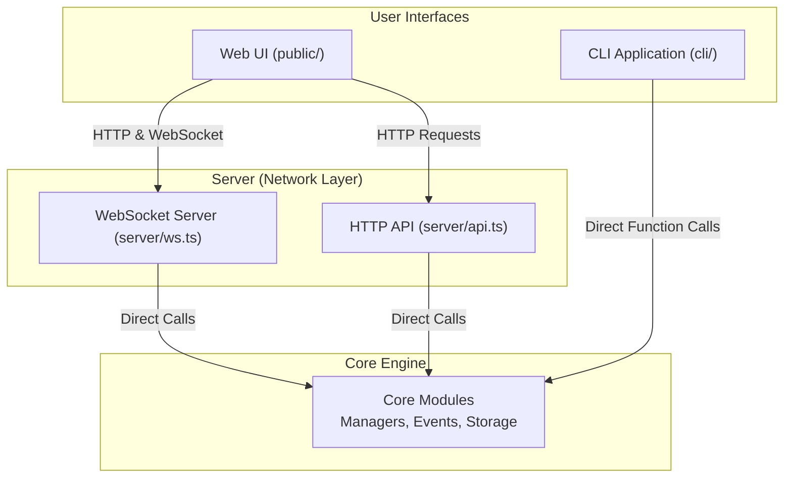
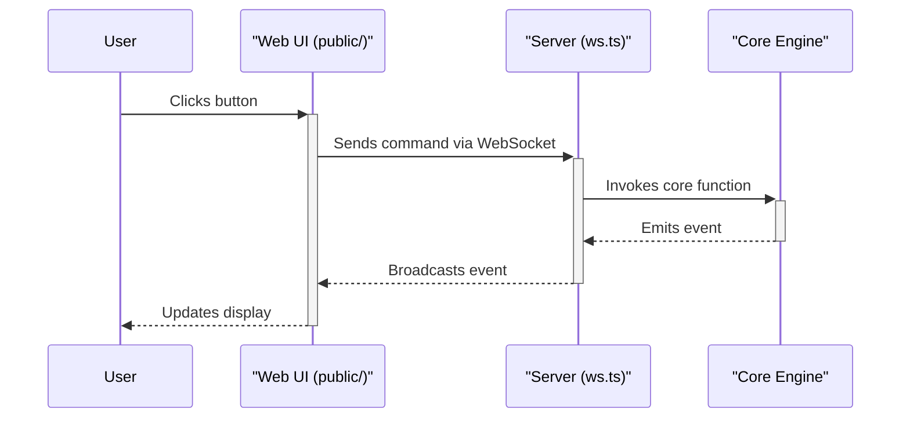
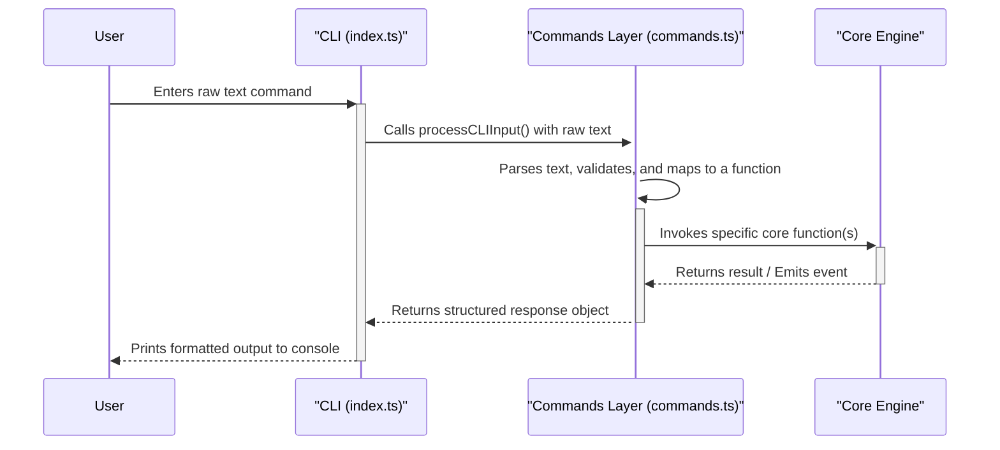

# Architecture Document: Agent World

## 1. High-Level Overview

The application is designed with a clear separation between its core logic, a server for network clients, and its user interfaces.

1.  **Core Engine (`core/`)**: The heart of the application, containing all the business logic, state management, and data persistence for the agent simulations. It is self-contained and can be used directly.
2.  **Server Layer (`server/`)**: Acts as a communication bridge, exposing the Core Engine's functionality to network clients via a WebSocket server and a standard HTTP API.
3.  **Client Layer (`public/`, `cli/`)**: The user-facing interfaces. The system supports two distinct clients:
    *   A browser-based **Web UI (`public/`)** that connects to the `server/` layer over the network.
    *   A **Command-Line Interface (`cli/`)** that runs in the same process as the Core Engine and interacts with it directly.

## 2. Component Diagram

This diagram illustrates the corrected component relationships.

## 3. Component Breakdown

### 3.1. Core Engine (`core/`)

This directory contains the simulation's entire logic. It is the system's source of truth and can be run independently.

*   **`*-manager.ts`**: Contains the primary business logic for managing worlds, agents, LLM interactions, and messages.
*   **`*-events.ts` & `subscription.ts`**: A pub/sub event system that allows different parts of the application to react to state changes.
*   **`*-storage.ts`**: The persistence layer, abstracting file system I/O for world and agent data.

### 3.2. Server Layer (`server/`)

This layer makes the Core Engine accessible to **remote** clients over the network.

*   **`ws.ts` & `api.ts`**: The WebSocket and HTTP servers. They act as wrappers around the Core Engine, listening for network requests and translating them into direct function calls to the `core` modules.
*   **State Management**: The WebSocket server (`ws.ts`) is stateful. For each connected client that subscribes to a world, the server maintains a reference to that client's specific `world` object instance. This is essential for managing event subscriptions and ensuring that events from a world are correctly routed only to the clients subscribed to it. This state is cleaned up when a client disconnects.

### 3.3. Client Layer

This layer contains the user-facing applications.

*   **`public/`**: A browser-based Web UI. It is a true remote client that communicates with the `server/` layer via WebSockets and HTTP.
*   **`cli/`**: The Command-Line Interface. It is a **local client** that is tightly coupled to the Core Engine. It imports and calls functions from the `core` modules directly.
*   **State Management**: During an interactive session, the CLI (`cli/index.ts`) maintains a stateful reference to the currently active `world` object. This allows it to receive real-time events from the core's pub/sub system and display them in the console. This `world` object provides the necessary context for executing user commands.

## 4. Interaction Flow

### Web UI (Remote Client)

### CLI (Local Client)

