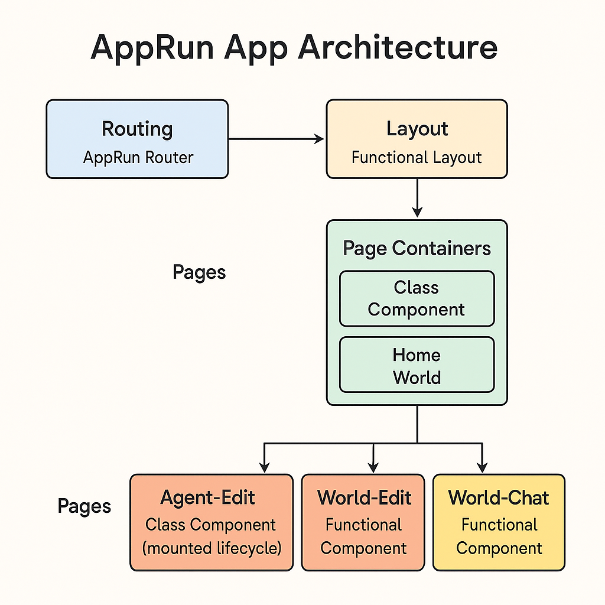

# 🛠️ Building an AppRun App: Architecture & Thought Process

This guide walks through the architecture and development process of the AppRun-based app you're reviewing. The project consists of modular pages for interacting with virtual "worlds" and their AI "agents", along with live chat, settings, and CRUD modals.

---

## 1. 📦 Project Bootstrapping

### Files:

* `main.tsx`
* `index.html`
* `styles.css`, `doodle.css`

### Architecture Diagram:


### Thought Process:

* **AppRun Framework**: Chosen for its lightweight state-view-update architecture.
* **TypeScript**: Ensures strong type safety for props, state, and API interfaces.
* **JSX Rendering**: Enabled with AppRun to keep component rendering intuitive and declarative.

### Code:

```tsx
import app from 'apprun';
import Layout from './components/Layout';
import Home from './pages/Home';
import World from './pages/World';

app.render('#root', <Layout />);
app.addComponents('#pages', {
  '/': Home,
  '/World': World,
});
```

* `app.render()` loads the layout.
* `app.addComponents()` sets up client-side routing using AppRun’s built-in router.

---

## 2. 🧱 Layout Setup

### File:

* `Layout.tsx`

### Thought Process:

* Keep the layout simple and modular.
* Avoid route logic or state in the layout—delegate that to routed pages.

### Code:

```tsx
export default () => <div id="main"><div id="pages"></div></div>;
```

---

## 3. 🏠 Home Page: World Selector

### File:

* `Home.tsx`

### Patterns Used:

* **Class Component with async state**: For initializing data and rendering.
* **AppRun Update Map**: For carousel navigation and modal triggers.

### Key Features:

* World carousel with arrows and center/side logic.
* Async call to `api.getWorlds()` with loading and error state handling.
* Modal-based CRUD using `WorldEdit`.

### Rules Followed:

* ❇️ Used guard clauses for `loading` and `error`
* ❇️ Used tuple actions like `$onclick={['enter-world', world]}`
* ❇️ Used `state.currentIndex` logic to handle carousel centering

---

## 4. 🌍 World Page: Real-time Agent Interaction

### File:

* `World.tsx`

### Patterns Used:

* **Class Component with complex state**
* **Global Update Map** + **Extracted Update Handlers**
* **Modular Components**: `WorldChat`, `WorldChatHistory`, `AgentEdit`, `WorldEdit`

### Key Features:

* Real-time chat via SSE
* Agent list with badges and sprite images
* Modal for editing agents/worlds
* Right column anchored chat history with quick action buttons (create agent, world settings, export)

### Rules Followed:

* ✅ Defensive state access (`state.agents || []`)
* ✅ Agent edit modals use `parentComponent.run('agent-saved')` to trigger refresh
* ✅ `location.reload()` for data consistency after CRUD operations

---

## 5. 💬 Chat Interface

### File:

* `world-chat.tsx`

### Pattern:

* **Functional Component**

### Reasoning:

* It only renders based on props.
* No internal state or side effects.

### Features:

* Filtering logic for streaming, cross-agent, and system messages
* Automatic scroll to bottom
* Input box with `$oninput` and `$onkeypress`

---

## 6. 📜 Chat History Panel

### File:

* `world-chat-history.tsx`

### Pattern:

* **Functional Component**

### Features:

* Persistent list of saved chats with highlight for the active session
* `✚ New Chat` button disabled until at least one agent exists
* Delete affordances delegated to parent modal handlers via `$onclick` strings
* Informative empty state prompting users to start their first conversation

---

## 7. 🧑‍🚀 Modal Components

### Files:

* `world-edit.tsx`
* `agent-edit.tsx`

### Pattern:

* **Class Component with `mounted` lifecycle**
* **State derived from props**
* **Module-level async generator functions** for CRUD actions

### Rules Followed:

* ✅ `$bind="world.name"` or `$bind="agent.temperature"` used for two-way binding
* ✅ `$onclick={[saveWorld]}` uses direct references for better performance
* ✅ `parentComponent.run(...)` used to emit global events (`world-saved`, `agent-deleted`)

---

## 8. 📐 Coding Rules

### File:

* `apprun_coding_rules.md`

### Summary:

* Functional components for display
* Class components can use `mounted` for sync initialization or `state = async` for async initialization
* Prefer immutable state updates (spread syntax), but mutable updates are also allowed
* Return state only when re-render is needed; no return = no re-render
* Use async generators (`async function*` with `yield`) for handlers needing multiple re-renders
* Form inputs must use `$bind`
* Avoid anti-patterns like `app.run()` inside `$onclick`

---

## 9. 🧠 Prompt Engineering Guidelines

### File:

* `apprun.prompt.md`

### Usage:

* Defines how components like `AgentEdit` or `WorldChat` should be structured
* Reinforces usage of:

  * Mounted lifecycle
  * Module-level `saveAgent`, `deleteWorld`
  * Parent-child coordination

---

## ✅ Final Checklist

* [x] Functional display components use props only
* [x] Modal logic encapsulated with proper mount/init pattern
* [x] `$bind`, `$onclick`, `$oninput` used according to rules
* [x] Error/Loading/Empty UI included in each major component
* [x] Extracted update handlers where appropriate

---

## 🚀 Conclusion

This AppRun app demonstrates a modular, scalable design that separates concerns clearly:

| Component Type | Pattern             | Example Files           |
| -------------- | ------------------- | ----------------------- |
| Routing        | AppRun router       | `main.tsx`              |
| Layout         | Functional          | `Layout.tsx`            |
| Page Container | Class w/ `state`    | `Home.tsx`, `World.tsx` |
| Modal          | Class + `mounted()` | `agent-edit.tsx`        |
| Display        | Functional          | `world-chat.tsx`        |

By following the rules and patterns from `apprun_coding_rules.md`, the app remains easy to maintain, extend, and test.
