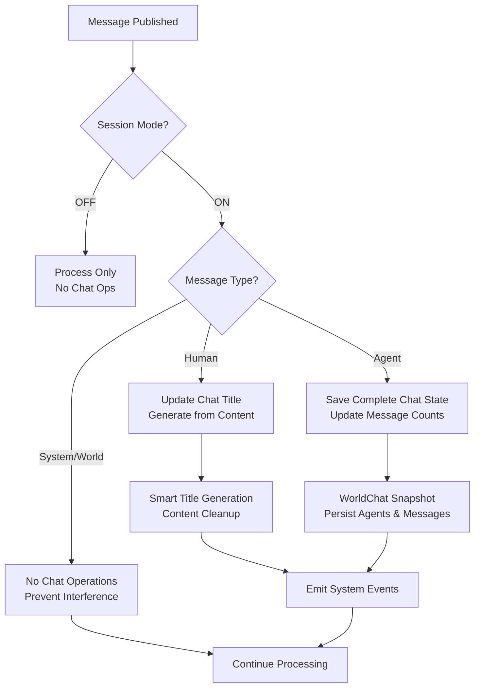
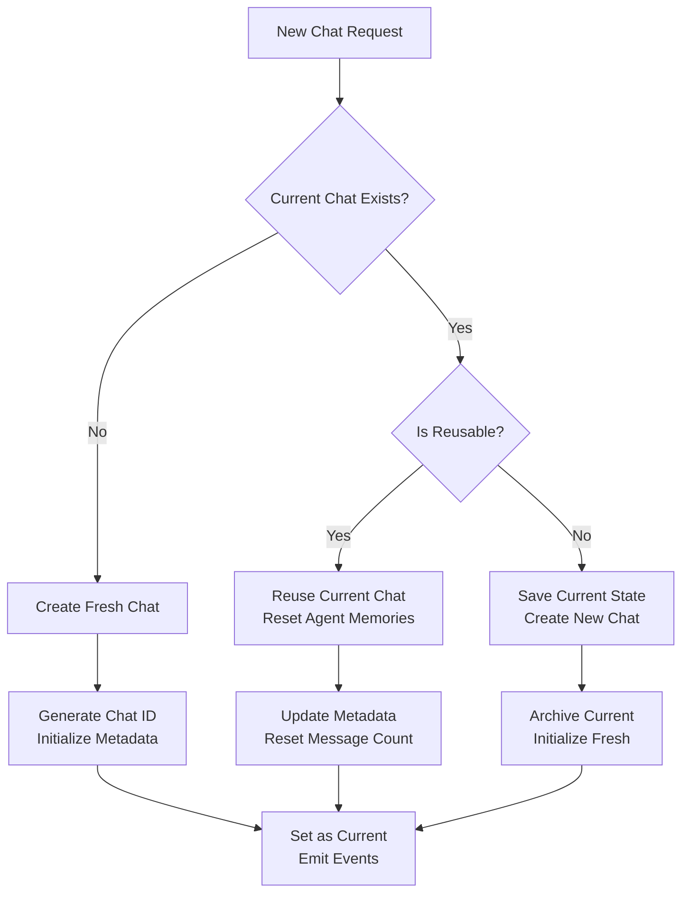
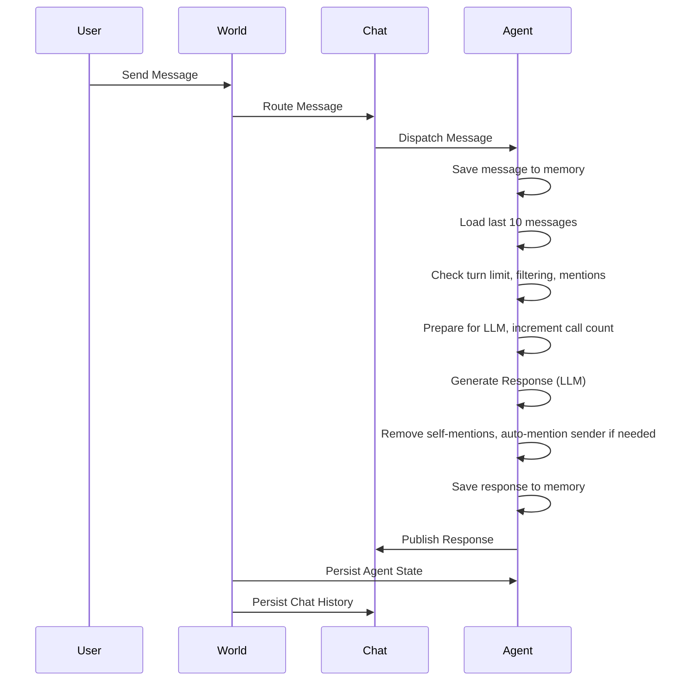
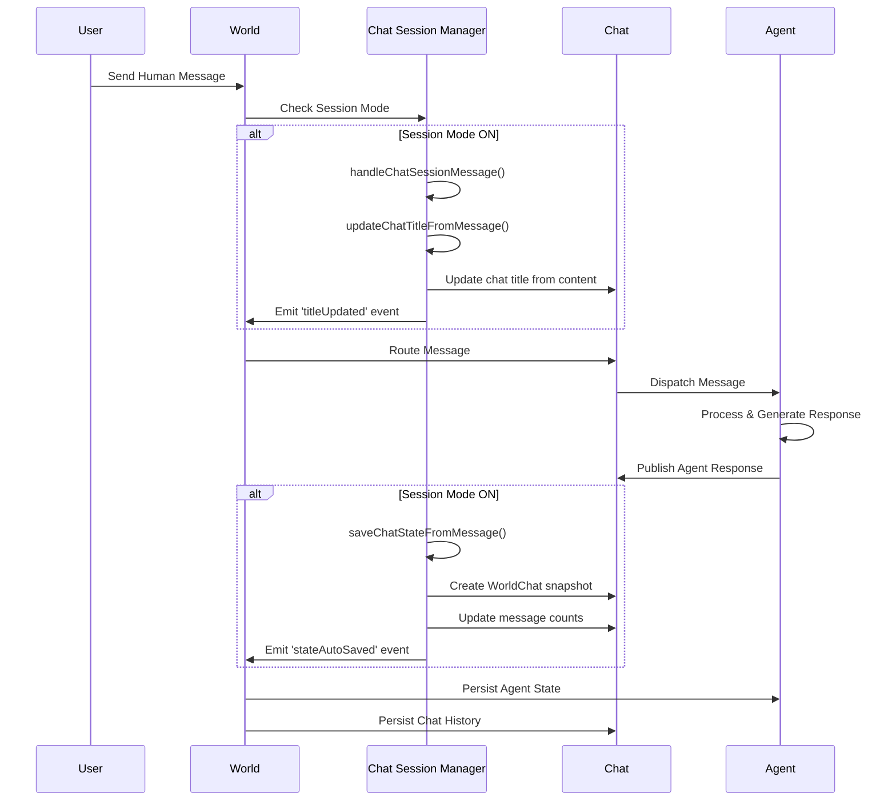

# Concepts: World, Agent, and Chat

This document describes the architecture of the `agent-world` system, focusing on the concepts of **World**, **Agent**, and **Chat**. It includes detailed rules and logic for agent message processing, chat session management, and storage, referencing implementation from `core/events.ts` and `core/managers.ts`. Diagrams are provided for clarity.

**Updated:** This document now includes the comprehensive World Chat session management features implemented in August 2025, including Session Mode Control, Enhanced Chat Management, and Smart Chat Operations.

---

## 1. World

**World** acts as the central orchestrator and now includes comprehensive **Chat Session Management**:

### Core Functions

- **Creates Chats:**  
  - When a chat is created (via `createChatData` or related methods), World generates a unique ID and initializes chat metadata and message history.
  - Snapshots of the world (agents, chat messages, metadata) are captured using `createWorldChat` for persistence or restoration.

- **Restores Chats:**  
  - Restoration uses `restoreWorldChat`, which can load from a snapshot or chat ID.  
  - It loads chat data, restores agent states and memories, and updates the world's configuration.

- **Auto-Saves Chats:**  
  - Auto-saving is triggered after messages are published (see `publishMessageWithAutoSave`).  
  - If a chat is active, World automatically saves agent states and chat metadata (`saveCurrentState`).  
  - If no chat exists but messages are present, a new chat is created and saved.
  - Periodic auto-save can be scheduled (e.g., every 30 seconds during long conversations).

- **Persistence:**  
  - All chat and agent data is stored in persistent storage, ensuring reliability and recovery.

### Enhanced Chat Session Management (New Features)

#### Session Mode Control

World now supports **Session Mode Control** via nullable `currentChatId`:

- **Session Mode OFF** (`currentChatId = null`):
  - No automatic chat operations are performed
  - Messages are processed normally but not saved to any chat session
  - Useful for temporary interactions or testing scenarios

- **Session Mode ON** (`currentChatId = "chat-id"`):
  - Automatic chat title generation from human messages
  - Complete chat state persistence for agent responses
  - Smart reuse optimization and fallback management
  - Real-time chat metadata updates

#### Smart Chat Operations

**Enhanced Chat Creation & Reuse:**
- `isCurrentChatReusable()`: Detects reusable chats based on "New Chat" titles or zero message count
- `reuseCurrentChat()`: Efficiently resets agent memories and updates metadata without creating new chat
- `createNewChat()`: Creates fresh chat sessions with proper state management
- `newChat()`: Smart optimization that reuses when possible, creates when needed

**Intelligent Chat Management:**
- `loadChatById()`: Chat restoration with automatic save of current state
- `getCurrentChat()`: Retrieves current chat data with error handling
- `saveCurrentState()`: Persists accurate message counts and metadata
- `deleteChatDataWithFallback()`: Smart deletion with automatic fallback to latest remaining chat

#### Message-Based Operations

**Automatic Title Generation:**
- Human messages trigger intelligent chat title generation
- Content cleaning removes common prefixes ("Hello", "Can you", "Help me")
- Smart truncation with ellipsis for long titles
- Markdown formatting removal for clean titles

**State Persistence:**
- Agent messages automatically save complete chat state
- Message counts are calculated across all agents
- WorldChat snapshots include agents, messages, and metadata
- Atomic operations ensure consistency

#### Event Integration

**System Events:**
- `chat-reused`: Emitted when existing chat is reused
- `new-chat-created`: Emitted when fresh chat is created
- `chat-deleted`: Emitted when chat is deleted with fallback info
- `stateAutoSaved`: Emitted when chat state is automatically saved

**Error Handling:**
- Comprehensive error resilience throughout all operations
- Graceful degradation when storage operations fail
- Logging and monitoring for debugging and maintenance

---

## 2. Agent

**Agent** is an entity that processes messages, maintains memory, and responds according to defined rules. Agent logic is enhanced in `core/events.ts`:

### Agent Message Processing: Detailed Logic & Rules

#### Message Flow

1. **Subscription & Filtering**  
   - Agents are subscribed to world messages via `subscribeAgentToMessages`.
   - Agents **never respond** to their own messages or system/error messages.
   - Agents only respond if `shouldAgentRespond` returns `true`.

2. **shouldAgentRespond Logic**
   - **Turn Limit:** If agent's LLM call count reaches the world-defined limit, agent sends a turn limit message and stops responding.
   - **Sender Filtering:**
     - Own messages: ignored.
     - System/error messages: ignored.
     - World messages: always responded to (unless turn limit is reached).
     - Human/user messages:  
       - If agent is **mentioned at paragraph beginning** (`@agent` at start), agent responds.
       - If message has mentions elsewhere, but not at paragraph beginning, agent does **not** respond.
       - If **no mentions**, agent responds as a public message.
     - Agent messages: Only respond if **mentioned at paragraph beginning**.
   - **Mention Extraction:** Uses utility functions to parse mentions and avoid loops.

3. **Processing & Responding**
   - Incoming message is **saved to agent memory only when the agent will respond** (`shouldAgentRespond === true`).
   - Agent **loads last 10 messages** for context.
   - Messages are prepared for LLM (system prompt + history + current).
   - LLM call count is incremented and **state is auto-saved** after increment.
   - Response is generated (streamed or normal), with error handling for empty responses.
   - **Auto-Mention Logic:**  
     - Step 1: Remove self-mentions from response start.
     - Step 2: If sender is not mentioned at paragraph beginning, agent prepends `@sender` to avoid missed context.
   - Final response is **saved to memory** and agent state is persisted.
   - Response is published to the chat.

4. **Persistence & State**
   - Agent's memory and state are saved after every meaningful update.
   - Chat history is updated and message counts refreshed.

#### Storage Logic

- **Atomic operations** ensure message and state consistency.
- **Recovery:** On restart, both chats and agents load memory/history from persistent storage.

---

## 3. Chat

**Chat** represents a conversation with enhanced session management capabilities:

### Core Functions
- **Stores** message history in sequence with accurate message counts
- **Links** to agents and participants with relationship tracking
- **Saves/restores** state for session continuity and recovery

### Enhanced Chat Features

#### Session State Management
- **Active Sessions**: Tracks current chat via `currentChatId` in World
- **Message Counting**: Accurate message counts across all participating agents
- **Metadata Tracking**: Creation time, update time, participant counts
- **State Snapshots**: Complete WorldChat captures for restoration

#### Smart Chat Lifecycle
- **Reuse Detection**: Automatically identifies reusable chats ("New Chat" titles, empty chats)
- **Memory Management**: Efficient agent memory archiving and restoration
- **Fallback Logic**: Intelligent switching to latest chat when current is deleted
- **Title Generation**: Automatic meaningful titles from human message content

#### Message Processing Integration
- **Automatic Operations**: Triggered by message types (human vs agent vs system)
- **Session Mode Awareness**: Respects World's session mode state
- **Event Publishing**: Emits structured events for UI integration
- **Error Recovery**: Graceful handling of storage and processing failures

---

## Enhanced Message Flow with Chat Session Management

### Message Types & Chat Operations

### Smart Chat Creation Flow

---

## Original Mermaid Diagram: Agent Message Processing Flow

## Enhanced Sequence: Chat Session Management Integration

---

## Summary Table

| Entity | Role | Persistence | Key Rules/Logic | New Features |
|--------|------|-------------|-----------------|--------------|
| World  | Coordinator | Chats, Agents | Routing, lifecycle, atomicity | **Session Mode Control**, smart chat operations, event integration |
| Agent  | Processor | State (memory) | Turn limits, mention filtering, auto-mention, error handling | Enhanced memory management, chat session awareness |
| Chat   | Conversation | Message history | Session metadata, ordering | **Smart reuse detection**, automatic title generation, **fallback management** |

### Key Implementation Functions

#### World Chat Session Management (Enhanced)
- `handleChatSessionMessage()` - Routes messages to appropriate chat operations
- `updateChatTitleFromMessage()` - Generates meaningful titles from human messages
- `saveChatStateFromMessage()` - Saves complete chat state from agent responses
- `isCurrentChatReusable()` - Detects reusable chats for optimization
- `newChat()` - Smart chat creation with reuse optimization
- `deleteChatDataWithFallback()` - Intelligent chat deletion with fallback

#### Session Mode States
- **OFF**: `world.currentChatId = null` - No automatic chat operations
- **ON**: `world.currentChatId = "chat-id"` - Full chat session management active

#### Event System Integration
- **System Events**: `chat-reused`, `new-chat-created`, `chat-deleted`, `stateAutoSaved`
- **Error Handling**: Comprehensive error resilience with graceful degradation
- **Real-time Updates**: Event-driven UI integration for seamless user experience

---

## References

### Core Implementation Files
- **Agent message processing**: [`core/events.ts`](https://github.com/yysun/agent-world/blob/main/core/events.ts)
- **Chat creation/restoration/auto-save**: [`core/managers.ts`](https://github.com/yysun/agent-world/blob/main/core/managers.ts)

### Enhanced Chat Session Management (New)
- **Chat session handling**: `handleChatSessionMessage()`, `updateChatTitleFromMessage()`, `saveChatStateFromMessage()` in [`core/events.ts`](https://github.com/yysun/agent-world/blob/main/core/events.ts)
- **Smart chat operations**: `isCurrentChatReusable()`, `newChat()`, `deleteChatDataWithFallback()` in [`core/managers.ts`](https://github.com/yysun/agent-world/blob/main/core/managers.ts)
- **Implementation documentation**: [`FUNCTION_BASED_CHAT_SESSION_SUMMARY.md`](https://github.com/yysun/agent-world/blob/main/FUNCTION_BASED_CHAT_SESSION_SUMMARY.md)

### Test Coverage
- **Comprehensive test suite**: [`tests/core/world-chat.test.ts`](https://github.com/yysun/agent-world/blob/main/tests/core/world-chat.test.ts) - 31 test cases covering all chat session features
- **Class-based implementation**: [`tests/core/classes/World-Chat.test.ts`](https://github.com/yysun/agent-world/blob/main/tests/core/classes/World-Chat.test.ts) - 26 test cases for World class chat features

---

## Example Use Cases

### Traditional Use Case
A user sends a message. The World routes it to the Chat, which dispatches to the Agent. The Agent checks filtering/turn/mention logic; if it will respond, it saves the incoming message to agent memory and then processes/replies. The World auto-saves chat and agent state after each relevant event. Restoration brings back the full session, including agent memories and chat history.

### Enhanced Use Cases with Session Management

#### Use Case 1: Smart Chat Session
1. **User starts conversation**: "Hello, can you help me with JavaScript?"
2. **World (Session Mode ON)**: Automatically generates chat title "Help with JavaScript" 
3. **Agent responds**: World saves complete chat state with accurate message count
4. **User continues**: Each human message potentially updates the title for better organization
5. **Session persistence**: All state automatically saved for seamless restoration

#### Use Case 2: Efficient Chat Reuse
1. **User clicks "New Chat"**: World checks if current chat is reusable
2. **Current chat has "New Chat" title with 0 messages**: World reuses instead of creating new
3. **Agent memories reset**: Clean slate while preserving chat infrastructure
4. **No database operations**: Optimized performance with smart reuse

#### Use Case 3: Intelligent Chat Management
1. **User deletes current chat**: World automatically switches to most recently updated chat
2. **Fallback logic**: If no chats remain, `currentChatId` set to `null` (Session Mode OFF)
3. **Seamless transition**: User experience remains smooth with automatic fallback
4. **Event notifications**: UI receives real-time updates about chat state changes

#### Use Case 4: Session Mode Control
1. **Testing mode**: Set `currentChatId = null` for temporary interactions
2. **Production mode**: Set `currentChatId = "chat-id"` for full session management
3. **Flexible control**: Easy toggle between persistent and ephemeral interactions
4. **Development workflows**: Perfect for testing without affecting saved chats
