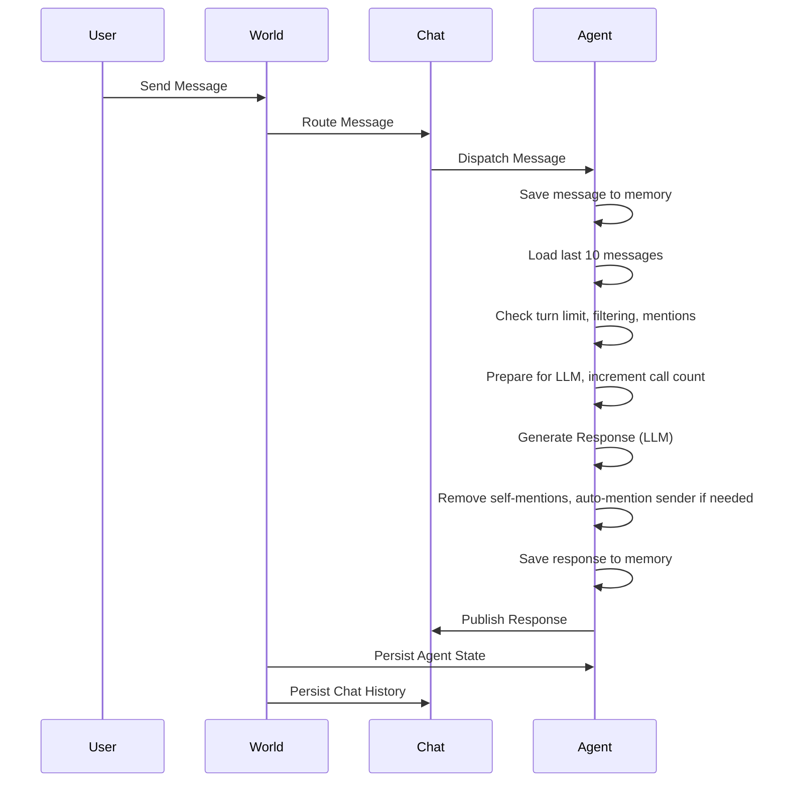

# Concepts: World, Agent, and Chat

This document describes the architecture of the `agent-world` system, focusing on the concepts of **World**, **Agent**, and **Chat**. It includes detailed rules and logic for agent message processing, chat management, and storage, referencing implementation from `core/events.ts` and `core/managers.ts`. Diagrams are provided for clarity.

---

## 1. World

**World** acts as the central orchestrator:

- **Creates Chats:**  
  - When a chat is created (via `createChatData` or related methods), World generates a unique ID and initializes chat metadata and message history.
  - Snapshots of the world (agents, chat messages, metadata) are captured using `createWorldChat` for persistence or restoration.

- **Restores Chats:**  
  - Restoration uses `restoreWorldChat`, which can load from a snapshot or chat ID.  
  - It loads chat data, restores agent states and memories, and updates the world's configuration.

- **Auto-Saves Chats:**  
  - Auto-saving is triggered after messages are published (see `publishMessageWithAutoSave`).  
  - If a chat is active, World automatically saves agent states and chat metadata (`saveCurrentState`).  
  - If no chat exists but messages are present, a new chat is created and saved.
  - Periodic auto-save can be scheduled (e.g., every 30 seconds during long conversations).

- **Persistence:**  
  - All chat and agent data is stored in persistent storage, ensuring reliability and recovery.

---

## 2. Agent

**Agent** is an entity that processes messages, maintains memory, and responds according to defined rules. Agent logic is enhanced in `core/events.ts`:

### Agent Message Processing: Detailed Logic & Rules

#### Message Flow

1. **Subscription & Filtering**  
   - Agents are subscribed to world messages via `subscribeAgentToMessages`.
   - Agents **never respond** to their own messages or system/error messages.
   - Agents only respond if `shouldAgentRespond` returns `true`.

2. **shouldAgentRespond Logic**
   - **Turn Limit:** If agent's LLM call count reaches the world-defined limit, agent sends a turn limit message and stops responding.
   - **Sender Filtering:**
     - Own messages: ignored.
     - System/error messages: ignored.
     - World messages: always responded to (unless turn limit is reached).
     - Human/user messages:  
       - If agent is **mentioned at paragraph beginning** (`@agent` at start), agent responds.
       - If message has mentions elsewhere, but not at paragraph beginning, agent does **not** respond.
       - If **no mentions**, agent responds as a public message.
     - Agent messages: Only respond if **mentioned at paragraph beginning**.
   - **Mention Extraction:** Uses utility functions to parse mentions and avoid loops.

3. **Processing & Responding**
   - Incoming message is **saved to agent memory** immediately, ensuring context is always stored.
   - Agent **loads last 10 messages** for context.
   - Messages are prepared for LLM (system prompt + history + current).
   - LLM call count is incremented and **state is auto-saved** after increment.
   - Response is generated (streamed or normal), with error handling for empty responses.
   - **Auto-Mention Logic:**  
     - Step 1: Remove self-mentions from response start.
     - Step 2: If sender is not mentioned at paragraph beginning, agent prepends `@sender` to avoid missed context.
   - Final response is **saved to memory** and agent state is persisted.
   - Response is published to the chat.

4. **Persistence & State**
   - Agent's memory and state are saved after every meaningful update.
   - Chat history is updated and message counts refreshed.

#### Storage Logic

- **Atomic operations** ensure message and state consistency.
- **Recovery:** On restart, both chats and agents load memory/history from persistent storage.

---

## 3. Chat

**Chat** represents a conversation, storing messages and metadata.

- **Stores** message history in sequence.
- **Links** to agents and participants.
- **Saves/restores** state for session continuity.

---

## Mermaid Diagram: Agent Message Processing Flow

---

## Summary Table

| Entity | Role | Persistence | Key Rules/Logic |
|--------|------|-------------|-----------------|
| World  | Coordinator | Chats, Agents | Routing, lifecycle, atomicity |
| Agent  | Processor | State (memory) | Turn limits, mention filtering, auto-mention, error handling |
| Chat   | Conversation | Message history | Session metadata, ordering |

---

## References

- Agent message processing: [`core/events.ts`](https://github.com/yysun/agent-world/blob/541e400501ea475e40db6175ad9e96c53e7894ec/core/events.ts)
- Chat creation/restoration/auto-save: [`core/managers.ts`](https://github.com/yysun/agent-world/blob/541e400501ea475e40db6175ad9e96c53e7894ec/core/managers.ts)

---

## Example Use Case

A user sends a message. The World routes it to the Chat, which dispatches to the Agent. The Agent saves the message, checks filtering/turn/mention logic, processes and replies if allowed. The World auto-saves the chat and agent state after each relevant event. Restoration brings back the full session, including agent memories and chat history.
