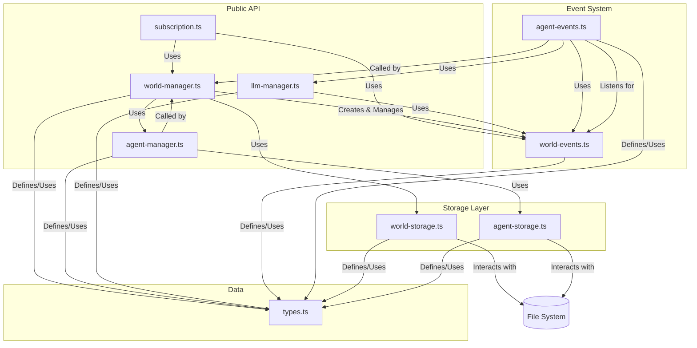

# Core Module Architecture

## 1. Overview

The `core` module is the heart of the Agent World application. It is a self-contained, dependency-free engine responsible for all simulation logic, data management, and state persistence. It is designed to be entirely decoupled from any presentation layer (like the CLI or a web server), interacting with the outside world only through a well-defined subscription interface and a set of manager modules.

The architecture is built on three main pillars:

1.  **Managers**: High-level modules that provide a public API for creating, reading, updating, and deleting (CRUD) the core entities: Worlds and Agents.
2.  **Storage**: Low-level modules responsible for the physical serialization and deserialization of data to and from the file system.
3.  **Events & Subscriptions**: A per-world, event-driven system that allows different parts of the application to communicate and react to state changes in a decoupled manner.

## 2. Component Diagram

This diagram illustrates the relationships between the key components within the `core` module.

## 3. Component Breakdown

### 3.1. Data (`types.ts`)

This is the foundational file that defines all the core data structures (`World`, `Agent`, `AgentMessage`, etc.) and `enum` types used throughout the entire application. It ensures type safety and data consistency.

### 3.2. Storage Layer (`*-storage.ts`)

This layer is the lowest level of the `core` module, responsible for direct file system interaction.

*   **`world-storage.ts`**: Handles the reading and writing of a world's `config.json` file. It works with a plain, serializable `WorldData` object, completely unaware of runtime concepts like EventEmitters.
*   **`agent-storage.ts`**: Manages the three-file structure for each agent (`config.json`, `system-prompt.md`, `memory.json`). It handles the serialization of agent data, including the conversion of `Date` objects for memory entries.

### 3.3. Manager Layer (`*-manager.ts`)

This layer provides the primary business logic and public API for interacting with the core entities.

*   **`world-manager.ts`**: The main entry point for managing worlds. It orchestrates the creation, loading, and updating of `World` objects. When a world is loaded, this manager is responsible for:
    1.  Calling `world-storage` to get the raw `WorldData`.
    2.  **Injecting a runtime `EventEmitter`** into the `World` object.
    3.  Calling `agent-manager` to load all associated agents into the world's `agents` map.
    4.  Triggering the subscription of each agent to the world's events.
*   **`agent-manager.ts`**: Handles the business logic for an agent's lifecycle. It is called by the `world-manager` and uses `agent-storage` to perform the underlying file operations.
*   **`llm-manager.ts`**: Manages all interactions with external Large Language Models. It uses a **global, singleton queue** to ensure that all LLM calls across the entire application are serialized, preventing rate-limiting issues. It publishes streaming events (start, chunk, end, error) to the specific `world.eventEmitter` it was called for.
*   **`message-manager.ts`**: A high-level utility for broadcasting messages within a world, using the `world-events` module.

### 3.4. Event System

The event system is the communication backbone of the `core` module. It is designed around a **per-world `EventEmitter` instance**. This is a critical design choice that ensures events from one world are completely isolated and do not interfere with others.

*   **`world-events.ts`**: Provides simple, direct functions (`publishMessage`, `subscribeToMessages`, `publishSSE`) for interacting with a given `world.eventEmitter`. It defines the basic event channels (`message`, `sse`).
*   **`agent-events.ts`**: Contains the logic that makes agents "live". The `subscribeAgentToMessages` function makes an agent listen to its world's `message` events. The `processAgentMessage` function contains the core agent AI logic: deciding if it should respond, preparing the context, calling the `llm-manager`, and publishing the response back to the world's event emitter.
*   **`subscription.ts`**: This is the **public interface** for the event system, designed for external consumers like the CLI or WebSocket server. It provides a clean `subscribeWorld` function that handles loading a world, setting up all necessary event listeners, and returning an `unsubscribe` function to prevent memory leaks.

## 4. Key Workflows

### World Loading

1.  **External Caller** (e.g., `subscription.ts`) calls `world-manager.getWorld("my-world")`.
2.  **`world-manager`** calls `world-storage.loadWorldFromDisk("my-world")` to get the raw `WorldData`.
3.  **`world-manager`** creates a runtime `World` object, injecting a new `EventEmitter` instance.
4.  **`world-manager`** calls `agent-manager.loadAgentsIntoWorld("my-world")`.
5.  **`agent-manager`** calls `agent-storage` to load all agents from disk.
6.  For each loaded agent, `world-manager` calls `agent-events.subscribeAgentToMessages(world, agent)`.
7.  **`agent-events`** sets up a listener on `world.eventEmitter` for the `message` event, linking it to the agent's processing logic.
8.  The fully hydrated `World` object, with live agents, is returned.

### Agent Message Processing

1.  A message is published on `world.eventEmitter` via `world-events.publishMessage`.
2.  The `message` event fires. The `agent-events` listener for each agent in that world is triggered.
3.  Each agent's `shouldAgentRespond` logic runs to determine if it should process the message (e.g., based on mentions, turn limits).
4.  If an agent should respond, `processAgentMessage` is called.
5.  `processAgentMessage` prepares the conversation history and calls `llm-manager.streamAgentResponse`.
6.  **`llm-manager`** adds the request to its global queue. When its turn comes, it executes the call to the AI SDK.
7.  As the LLM streams back chunks, `llm-manager` uses `world-events.publishSSE` to put `chunk` events onto the original `world.eventEmitter`.
8.  When the stream is complete, the final response is published back to the `world.eventEmitter` as a new `message` event, potentially triggering other agents.

This architecture ensures a clean separation of concerns, making the core engine robust, testable, and independent of how it is used.
