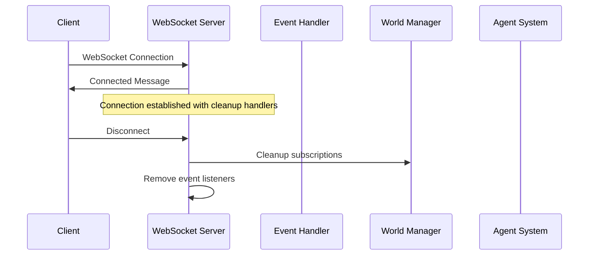
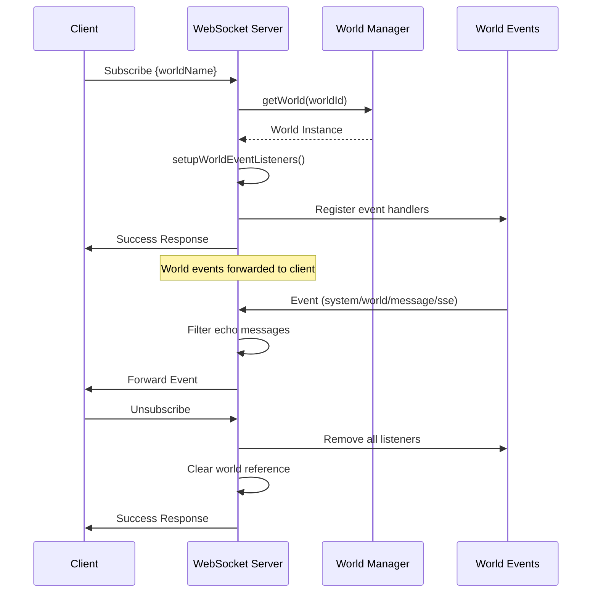
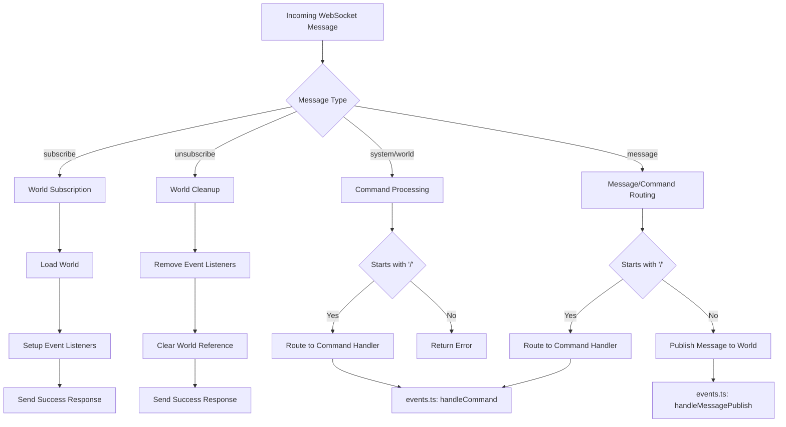
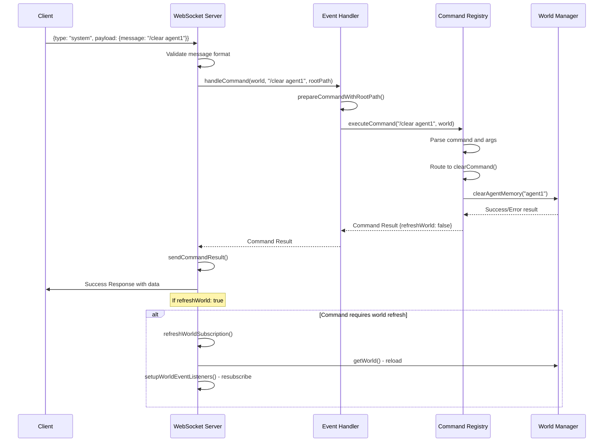
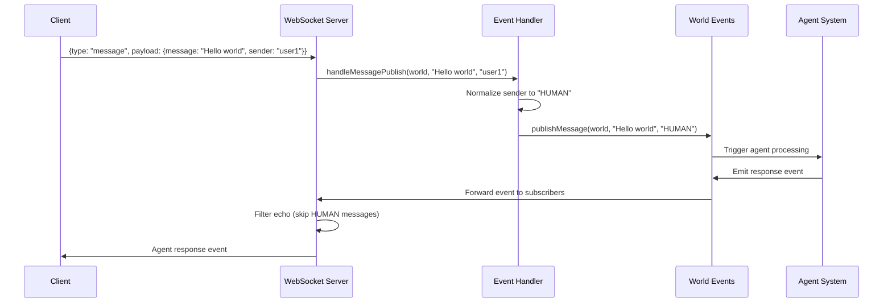
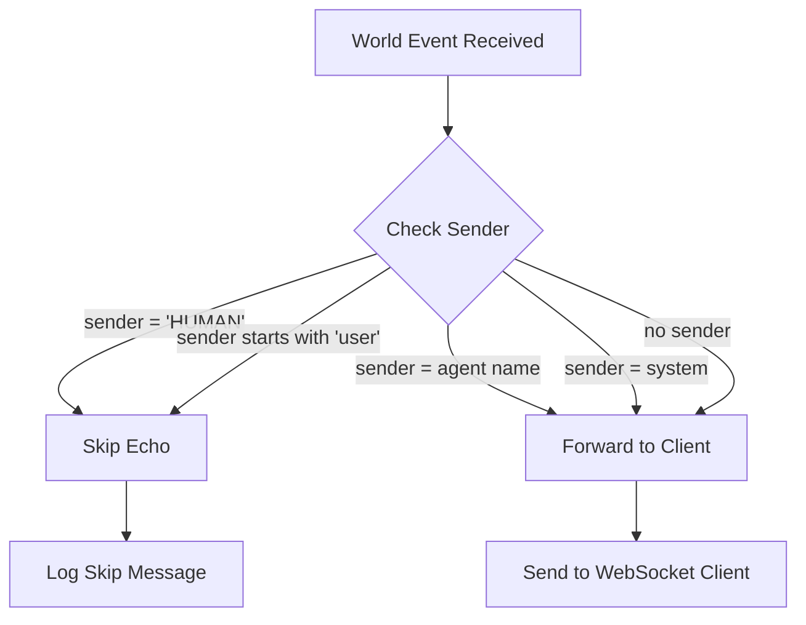
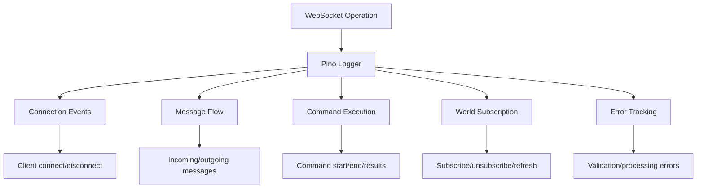

# WebSocket Events and Commands Architecture

## Overview

The Agent World WebSocket system provides real-time communication between clients and the server through a stateful connection management layer that handles world subscriptions and stateless event processing for commands and messages.

## Architecture Components

### Core Components
- **ws.ts**: Stateful WebSocket connection and subscription lifecycle management
- **events.ts**: Stateless command execution and message publishing
- **index.ts**: Command registry and execution logic

### Key Features
- Transport-agnostic event handling
- Per-connection world subscription with automatic cleanup
- Real-time event forwarding with echo prevention
- Comprehensive logging and error handling

## WebSocket Message Flow

### Connection Lifecycle



### World Subscription Flow



## Message Types and Processing

### Message Type Architecture



### Command Processing Flow



## Command Categories

### Global Commands (No World Context Required)
- `/getWorlds` - List all available worlds
- `/addWorld` - Create new world

### World Commands (Require Active Subscription)
- `/clear [agentName]` - Clear agent memory
- `/getWorld` - Get current world info
- `/updateWorld` - Update world properties
- `/addAgent` - Add new agent
- `/updateAgentConfig` - Update agent configuration
- `/updateAgentPrompt` - Update agent system prompt
- `/updateAgentMemory` - Modify agent memory

### Message Flow for Non-Commands



## Event Filtering and Echo Prevention

### Echo Prevention Logic



## Error Handling and Logging

### Comprehensive Logging Strategy



### Error Response Structure

```json
{
  "type": "error",
  "error": "Error message",
  "details": "Optional additional details",
  "timestamp": "2025-07-01T12:00:00.000Z"
}
```

## Data Response Formats

### Success Response Structure

```json
{
  "type": "success",
  "message": "Operation completed successfully",
  "data": "Optional result data",
  "refreshWorld": false,
  "timestamp": "2025-07-01T12:00:00.000Z"
}
```

### Event Forwarding Structure

```json
{
  "eventType": "message",
  "sender": "agent1",
  "message": "Agent response text",
  "timestamp": "2025-07-01T12:00:00.000Z"
}
```

## Configuration and Environment

### Key Environment Variables
- `LOG_LEVEL`: Controls logging verbosity (debug, info, warn, error)
- `NODE_ENV`: Determines log formatting (pretty in dev, JSON in prod)
- `AGENT_WORLD_DATA_PATH`: Root path for world data storage

### WebSocket Server Configuration
- Attached to existing HTTP server
- Per-connection state management
- Automatic cleanup on disconnect
- Structured error handling with client feedback

## State Management

### Connection State per WebSocket

```typescript
interface WorldSocket extends WebSocket {
  world?: World;                                    // Current subscribed world
  worldEventListeners?: Map<string, Function>;     // Event listener cleanup map
}
```

### Lifecycle Management

1. **Connection**: Initialize empty state
2. **Subscribe**: Load world, setup listeners, store references
3. **Command/Message**: Process with current world context
4. **Refresh**: Reload world, resubscribe to events
5. **Unsubscribe/Disconnect**: Clean up listeners, clear references

## Integration Points

### With Core System
- **World Manager**: World loading and management
- **Agent System**: Command execution and message processing
- **Event System**: Real-time event publishing and subscription

### With Client Applications
- **Web UI**: Real-time updates and command execution
- **CLI Tools**: WebSocket-based remote operations
- **API Integration**: Programmatic access to world operations

## Performance Considerations

### Memory Management
- Automatic event listener cleanup prevents memory leaks
- Per-connection world references with proper disposal
- Efficient message filtering to reduce unnecessary network traffic

### Scalability Features
- Stateless command processing enables horizontal scaling
- Per-connection isolation prevents cross-contamination
- Structured logging enables monitoring and debugging at scale

---

*This architecture enables real-time, bidirectional communication between clients and the Agent World system while maintaining clean separation of concerns and robust error handling.*
