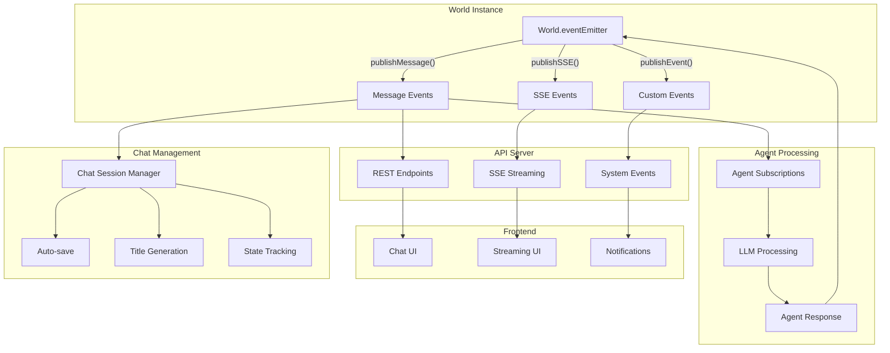
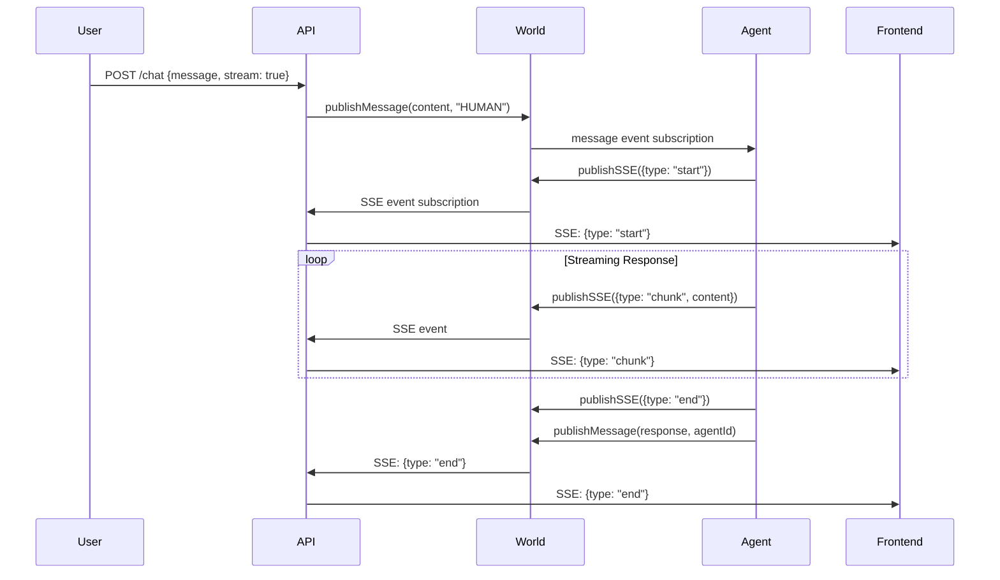
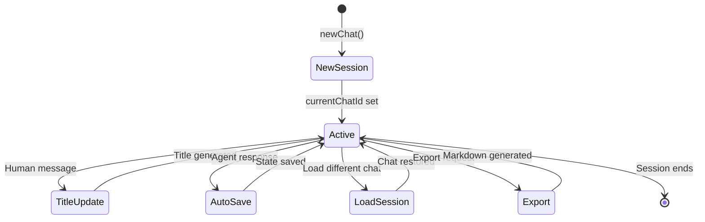

# Agent World Event and Message System Analysis

## 1. Event Types

### A. Message Events
- **Type:** `WorldMessageEvent`
- **Fields:** `content`, `sender`, `timestamp`, `messageId`
- **Emitted by:** `publishMessage(world, content, sender)` → `world.eventEmitter.emit('message', messageEvent)`
- **Purpose:** Represents a chat message (from human, agent, or system) within a world.
- **Chat Integration:** Automatically triggers chat session management (title updates, auto-save)

### B. SSE Events
- **Type:** `WorldSSEEvent`
- **Fields:** `agentName`, `type`, `content`, `error`, `messageId`, `usage`
- **Emitted by:** `publishSSE(world, data)` → `world.eventEmitter.emit('sse', sseEvent)`
- **Purpose:** Used for streaming events (start, chunk, end, error, chat-created, chat-updated) to the frontend via Server-Sent Events.
- **Types:** `'start' | 'chunk' | 'end' | 'error' | 'chat-created' | 'chat-updated'`

### C. System Events
- **Type:** Generic events via `publishEvent(world, type, content)`
- **Emitted by:** `world.eventEmitter.emit(type, content)`
- **Purpose:** Channel-specific events for system notifications, world events, etc.
- **Channels:** `'system'`, `'world'`, custom event types

### D. Chat Session Events
- **Integration:** Chat events are published as both message events and SSE events
- **Auto-save:** Agent messages trigger automatic chat state saving
- **Title Generation:** Human messages trigger automatic chat title updates
- **State Management:** currentChatId tracking for active chat sessions

---

## 2. Event Flow and Architecture

### A. World EventEmitter (Core)
- **Source:** All events originate from each `World.eventEmitter` instance
- **Isolation:** Events are naturally scoped to individual World instances (no cross-world interference)
- **Event Channels:**
  - `'message'` - Chat messages, system notifications
  - `'sse'` - Streaming responses and real-time updates
  - Custom channels via `publishEvent(world, type, content)`

### B. Core Event Functions
- **publishMessage(world, content, sender):**
  - Creates `WorldMessageEvent` with automatic ID and timestamp generation
  - Emits to `world.eventEmitter.emit('message', messageEvent)`
  - Triggers automatic chat session management (titles, auto-save)
  
- **publishSSE(world, data):**
  - Creates `WorldSSEEvent` for streaming responses
  - Emits to `world.eventEmitter.emit('sse', sseEvent)`
  - Used by LLM streaming and real-time updates
  
- **publishEvent(world, type, content):**
  - Generic event publishing for custom channels
  - Emits to `world.eventEmitter.emit(type, content)`

### C. Agent Event Processing
- **Subscription:** `subscribeAgentToMessages(world, agent)` for automatic agent responses
- **Message Processing:** Agents automatically process incoming messages via event handlers
- **Response Generation:** Agent responses are published back as new message events
- **Memory Management:** All messages are automatically saved to agent memory
- **Auto-mention Logic:** Prevents agent loops while preserving explicit mentions

### D. Chat Session Management
- **Current Chat Tracking:** `world.currentChatId` maintains active chat session
- **Auto-save:** Agent messages trigger automatic chat state saving
- **Title Generation:** Human messages trigger automatic chat title updates from message content
- **New Chat Optimization:** Reusable "New Chat" sessions to reduce database operations

---

## 3. API Server Integration

### A. REST API Endpoints
- **World Management:**
  - `GET /worlds` - List all worlds
  - `GET /worlds/:worldName` - Get world with serialized agents and chats
  - `POST /worlds` - Create new world
  - `PATCH /worlds/:worldName` - Update world configuration
  - `DELETE /worlds/:worldName` - Delete world

- **Agent Management:**
  - `POST /worlds/:worldName/agents` - Create new agent
  - `PATCH /worlds/:worldName/agents/:agentName` - Update agent
  - `DELETE /worlds/:worldName/agents/:agentName` - Delete agent
  - `DELETE /worlds/:worldName/agents/:agentName/memory` - Clear agent memory

- **Chat Management:**
  - `POST /worlds/:worldName/chat` - Send message (streaming or non-streaming)
  - `POST /worlds/:worldName/new-chat` - Create new chat session
  - `POST /worlds/:worldName/load-chat/:chatId` - Load existing chat
  - `DELETE /worlds/:worldName/chats/:chatId` - Delete chat
  - `GET /worlds/:worldName/export` - Export world to markdown

### B. SSE Streaming Integration
- **Endpoint:** `POST /worlds/:worldName/chat` with `stream: true`
- **Headers:** `Content-Type: text/event-stream`, CORS headers
- **Event Subscription:** API server subscribes to world's SSE events
- **Data Format:** `data: {"type": "sse", "data": {...}}\n\n`
- **Event Types:**
  - `start` - Agent begins responding
  - `chunk` - Streaming content chunk
  - `end` - Response complete
  - `error` - Streaming error
  - `chat-created` - New chat session created
  - `chat-updated` - Chat session updated

### C. Response Serialization
- **serializeWorld(world):** Converts World object to JSON with agents array and chats array
- **serializeAgent(agent):** Converts Agent object to JSON with UI properties (spriteIndex, messageCount)
- **Consistency:** All endpoints return serialized data format for frontend compatibility

---

## 4. Frontend Integration

### A. SSE Client (`web/src/utils/sse-client.ts`)
- **sendChatMessage(worldName, message, sender):** Unified SSE streaming function
- **Event Processing:** Handles SSE data transformation to AppRun events
- **State Management:** Maintains streaming state for active messages
- **AppRun Integration:** Direct event publishing via `app.run(eventType, data)`

### B. Event Handler Types
- **handleStreamStart:** Initialize streaming message in UI
- **handleStreamChunk:** Update streaming content with accumulated text
- **handleStreamEnd:** Finalize streaming message and clean up state
- **handleStreamError:** Handle streaming errors with user feedback
- **handleChatCreated/Updated:** Chat session management notifications

### C. Component State Management
- **WorldComponentState:** Consolidated state interface for world components
- **SSEComponentState:** Base interface for SSE-enabled components
- **Message Interface:** UI message structure with streaming properties
- **Type Safety:** Full TypeScript integration with proper interfaces

### D. Real-time Updates
- **Streaming Messages:** Live agent response rendering
- **Chat Session Updates:** Real-time chat creation and loading
- **Error Handling:** User-friendly error display with retry capabilities
- **Connection Management:** Automatic reconnection and cleanup

---

## 5. Data Flow Summary

### A. Message Publication Flow
1. **Human Input:** User sends message via frontend
2. **API Processing:** `POST /worlds/:worldName/chat` receives message
3. **Event Publishing:** `publishMessage(world, content, "HUMAN")` 
4. **World Events:** `world.eventEmitter.emit('message', messageEvent)`
5. **Agent Processing:** Subscribed agents process message automatically
6. **Agent Response:** Agent generates response and publishes new message
7. **SSE Streaming:** Agent response streamed via SSE events to frontend
8. **Chat Management:** Auto-save and title updates triggered automatically

### B. SSE Streaming Flow
1. **Agent Response:** LLM generates streaming response
2. **SSE Events:** `publishSSE(world, {type: 'chunk', content, agentName})`
3. **API Subscription:** Server subscribes to world SSE events
4. **HTTP Stream:** `res.write(data: JSON.stringify(sseEvent))` 
5. **Frontend Processing:** SSE client processes and transforms to AppRun events
6. **UI Updates:** React-like state updates render streaming content

### C. Chat Session Flow
1. **Session Creation:** `newChat()` creates new chat with fresh agent state
2. **Chat Tracking:** `world.currentChatId` maintains active session
3. **Auto-save:** Agent messages trigger `saveChatState()` automatically
4. **Title Updates:** Human messages trigger `updateChatTitle()` from content
5. **Session Loading:** `loadChatById()` restores previous chat state
6. **Export:** `exportWorldToMarkdown()` generates complete chat history

---

## 6. Architecture Diagrams

### A. Event System Overview

### B. SSE Data Flow

### C. Chat Session Lifecycle

---

## 7. Key Implementation Details

### A. Event Isolation
- **Per-World EventEmitters:** Each World instance has its own EventEmitter preventing cross-world event interference
- **Natural Scoping:** Events are automatically scoped to the world instance where they originate
- **No Global State:** No global event system or complex event routing required

### B. Performance Optimizations
- **Static Imports:** Core modules (events, llm-manager, utils) use static imports eliminating dynamic import overhead
- **Storage Factory:** Environment-aware storage functions with single initialization
- **Batch Operations:** Support for batch agent creation and memory operations
- **Stream Management:** Efficient SSE streaming with proper timer management and cleanup

### C. Type Safety
- **TypeScript Integration:** Full type safety across event system with proper interfaces
- **Event Payload Mapping:** `EventPayloadMap` ensures payload types match event types
- **Runtime Validation:** Zod schemas for API request validation
- **Type Guards:** Runtime type checking for component state management

### D. Error Handling
- **Graceful Degradation:** SSE streaming falls back to non-streaming mode on errors
- **Comprehensive Logging:** Category-based logging system for debugging and monitoring
- **Connection Management:** Automatic cleanup and reconnection handling
- **Validation:** Input validation at API boundaries with meaningful error messages

### E. Chat Session Management
- **Optimization:** Reusable "New Chat" sessions reduce database operations
- **Auto-save:** Automatic chat state persistence based on message events
- **Title Generation:** Intelligent chat title generation from message content analysis
- **State Tracking:** Consistent currentChatId management across all operations

---

## 8. Summary

The Agent World event system provides a robust, type-safe, and performant foundation for real-time chat applications with the following key characteristics:

- **Decentralized Events:** Each World instance maintains its own EventEmitter for natural event scoping
- **Unified API:** Core event functions (publishMessage, publishSSE, publishEvent) provide consistent interfaces
- **Real-time Streaming:** Full SSE integration for live agent responses and system updates  
- **Chat Management:** Integrated chat session lifecycle with auto-save and title generation
- **Type Safety:** Complete TypeScript integration with runtime validation
- **Performance:** Optimized for high-throughput scenarios with minimal overhead
- **Scalability:** Architecture supports multiple worlds and agents without interference

The system successfully bridges the gap between backend event processing and frontend real-time updates while maintaining clean separation of concerns and robust error handling throughout the entire stack.
