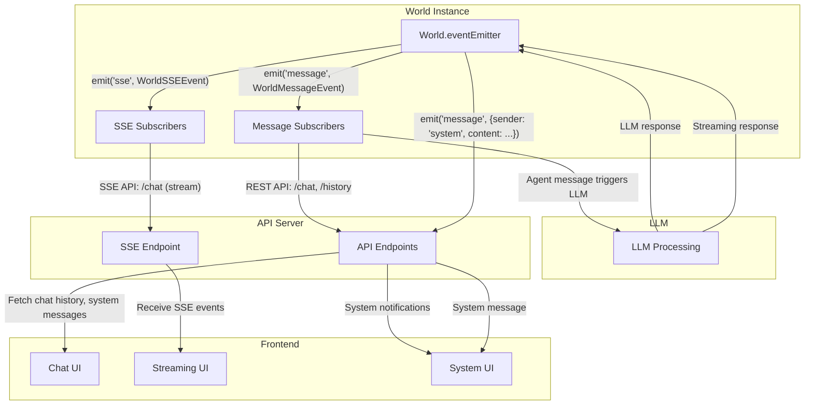

# Agent World Event and Message System Analysis

## 1. Event Types

### A. Message Events
- **Type:** `WorldMessageEvent`
- **Fields:** `content`, `sender`, `timestamp`, `messageId`
- **Emitted by:** `world.eventEmitter.emit('message', messageEvent)`
- **Purpose:** Represents a chat message (from human, agent, or system) within a world.

### B. SSE Events
- **Type:** `WorldSSEEvent`
- **Fields:** `agentName`, `type`, `content`, `error`, `messageId`, `usage`
- **Emitted by:** `world.eventEmitter.emit('sse', sseEvent)`
- **Purpose:** Used for streaming events (start, chunk, end, error, chat-created, chat-updated) to the frontend via Server-Sent Events.

### C. System Messages
- **Type:** `WorldMessageEvent` (with `sender: 'system'`)
- **Fields:** Same as message events, but content is typically a JSON string describing the event (e.g., chat-created, chat-updated).
- **Purpose:** Used for system-level notifications (e.g., chat creation, chat updates) sent as regular messages.

---

## 2. Event Flow and Transformation

### A. World Event Emitter
- **Source:** All events originate from the `World.eventEmitter`.
- **Emits:**
  - `'message'` events for chat messages and system notifications.
  - `'sse'` events for streaming responses and real-time updates.

### B. LLM (Language Model) Integration
- **Consumes:** Message events for agent processing.
- **Produces:** New agent messages, which are published back as message events.
- **Streaming:** LLM responses may be chunked and emitted as SSE events for real-time frontend updates.

### C. API Server
- **Subscribes:** To both `'message'` and `'sse'` events from the world.
- **Transforms:**
  - **Message Events:** Used for chat history, system notifications, and agent responses.
  - **SSE Events:** Transformed into HTTP SSE responses for the frontend.
- **Routes:** REST endpoints and SSE streaming endpoints expose these events to the frontend.

### D. Frontend
- **Receives:**
  - **SSE Events:** For real-time updates (streaming, chat-created, chat-updated).
  - **Message Events:** For chat history and system notifications.
- **Handles:** UI updates, chat rendering, and system notifications based on event type.

---

## 3. Mapping Table

| Event Type      | Emitter/Source         | API Server Role         | Frontend Role           | Example Use Case                |
|-----------------|-----------------------|-------------------------|-------------------------|---------------------------------|
| message         | World.eventEmitter     | REST API, history       | Chat UI, notifications  | Human/agent/system messages     |
| sse             | World.eventEmitter     | SSE endpoint            | Real-time UI updates    | Streaming LLM responses         |
| system message  | World.eventEmitter     | REST API, history       | System notifications    | Chat-created, chat-updated      |

---

## 4. Mermaid Diagram

---

## 5. Detailed Transformation Example

- **Human sends message:**  
  → `publishMessage(world, "Hello!", "HUMAN")`  
  → `World.eventEmitter.emit('message', ...)`  
  → API server receives event, updates chat history  
  → Frontend fetches chat history, displays message

- **Agent responds (LLM):**  
  → LLM processes message, generates response  
  → `publishMessage(world, "Hi there!", "agent-1")`  
  → `World.eventEmitter.emit('message', ...)`  
  → API server updates chat history  
  → Frontend updates chat UI

- **Streaming LLM response:**  
  → LLM streams response chunks  
  → `publishSSE(world, {type: 'chunk', ...})`  
  → API server sends SSE to frontend  
  → Frontend displays streaming message

- **System event (chat-created):**  
  → `publishMessage(world, JSON.stringify({type: 'chat-created', ...}), 'system')`  
  → `World.eventEmitter.emit('message', ...)`  
  → API server updates chat history  
  → Frontend displays system notification

---

## 6. Summary

- **Message events** are the backbone for chat and system notifications.
- **SSE events** are used for real-time streaming and updates.
- **System messages** (e.g., chat-created, chat-updated) are now sent as regular message events with `sender: 'system'`.
- **API server** bridges the event system to REST and SSE endpoints.
- **Frontend** consumes both message and SSE events for UI updates.
