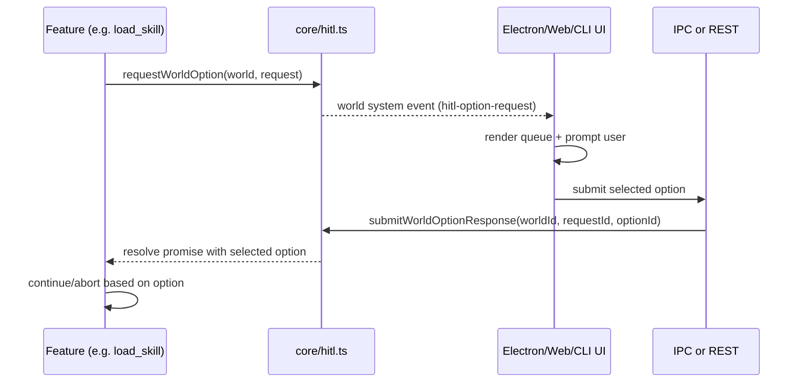

# HITL Approval Flow (Core, Electron, Web, CLI)

This document explains how Human-in-the-Loop (HITL) approval works in the current codebase.

## Purpose

HITL provides an option-based approval gate for actions that require user confirmation.  
The runtime is generic and world-scoped, so any feature can request options and block until:

- a user selects an option, or
- the request times out and uses a deterministic default option.

## Core Runtime

Primary implementation: `core/hitl.ts`.

### Data Model

- Request API: `requestWorldOption(world, request)`
- Response API: `submitWorldOptionResponse({ worldId, requestId, optionId })`
- Pending requests are stored in-memory in a process-local map:
  - key: `worldId::requestId`
  - value includes allowed option IDs, resolver, timeout handle, and chat scope.

### Request Lifecycle

When `requestWorldOption()` is called:

1. Options are normalized and deduplicated.
2. `requestId` is resolved (provided or generated).
3. `chatId` is resolved (`request.chatId` or `world.currentChatId`).
4. Default option is resolved:
   - preferred default if valid
   - else `no` if present
   - else first option.
5. Pending entry is inserted into the map.
6. A world `system` event is emitted with payload:
   - `eventType: "hitl-option-request"`
   - request metadata (`requestId`, title, message, options, defaultOptionId, timeoutMs, metadata).
7. The Promise remains pending until response or timeout.

### Resolution Lifecycle

When `submitWorldOptionResponse()` is called:

1. Validates `worldId`, `requestId`, `optionId`.
2. Looks up pending request by `worldId::requestId`.
3. Validates selected option exists in pending option set.
4. Clears timeout, removes pending map entry.
5. Resolves requester promise with `{ source: "user", optionId, ... }`.

If request times out:

- pending entry is removed,
- promise resolves with `{ source: "timeout", optionId: defaultOptionId, ... }`.

## Where HITL Is Triggered Today

Current trigger in core: `core/load-skill-tool.ts`.

- `load_skill` performs a skill-level HITL gate before applying skill instructions.
- The prompt includes detected local script references (if any).
- Session approval is scoped by `worldId + chatId + skillId` when selecting `yes_in_session`.
- If declined, tool returns a structured declined payload and does not load instructions.

### `yes_once` vs `yes_in_session` (load_skill)

In `core/load-skill-tool.ts`, these options are handled differently:

- `yes_once`: approves only the current request and is not cached.
- `yes_in_session`: caches approval in-memory for the current runtime process.
- `no`: rejects the request and skill instructions are not loaded.

The cache key format is:

- `worldId::chatId::skillId`

That means approval is per-skill and scoped to world/chat context.

### Does approval apply to all skills?

No. Approval is not global.

- `yes_in_session` for one skill does not approve other skills.
- A different `skillId` requires its own HITL approval.

## Electron Flow

Relevant files:

- `electron/main-process/realtime-events.ts`
- `electron/main-process/message-serialization.ts`
- `electron/renderer/src/App.jsx`
- `electron/preload/bridge.ts`
- `electron/main-process/ipc-handlers.ts`
- `electron/shared/ipc-contracts.ts`

Flow:

1. Core emits world `system` event with `hitl-option-request`.
2. Electron main serializes and forwards as `chat:event` payload type `system`.
3. Renderer subscription handler parses system payload and enqueues prompt.
4. Modal is rendered from queue (`hitlPromptQueue`).
5. User selects option.
6. Renderer calls preload bridge `respondHitlOption(...)`.
7. Main IPC handler delegates to `submitWorldOptionResponse(...)`.
8. Core resolves blocked request.

Invoke channel used for response:

- `hitl:respond` (`DESKTOP_INVOKE_CHANNELS.HITL_RESPOND`).

## Web Flow

Relevant files:

- `web/src/domain/hitl.ts`
- `web/src/pages/World.update.ts`
- `web/src/api.ts`
- `server/api.ts`

Flow:

1. Web receives `system` event over SSE stream.
2. `parseHitlPromptRequest()` validates/enriches request payload.
3. Request is added to `hitlPromptQueue`.
4. User selects option in UI.
5. Web calls `api.respondHitlOption(worldName, requestId, optionId, chatId)`.
6. Server endpoint `POST /worlds/:worldName/hitl/respond` calls `submitWorldOptionResponse`.
7. Core resolves blocked request.

## CLI Flow

Relevant files:

- `cli/hitl.ts`
- `cli/index.ts`

Flow:

1. CLI listens to world `system` events.
2. `parseHitlOptionRequest()` parses `hitl-option-request`.
3. Interactive mode:
   - prompts user to choose by index or option ID,
   - submits via `submitWorldOptionResponse`.
4. Pipeline/non-interactive mode:
   - auto-submits `defaultOptionId` to avoid blocking.

## End-to-End Sequence

## Validation and Guardrails

- Option IDs are validated against pending request option set.
- Responses for unknown/expired `requestId` are rejected (`accepted: false`).
- Timeout fallback is deterministic (no hanging waits).
- Scope is world-specific (`worldId::requestId`) to avoid cross-world collisions.
- Runtime is in-memory and process-local (not persisted across process restarts).

## Operational Notes

- Prompt visibility in clients depends on active event subscription for the target world/chat.
- Multiple pending requests are supported through unique `requestId` keys.
- For new HITL use cases, prefer `requestWorldOption()` rather than ad-hoc approval events.
