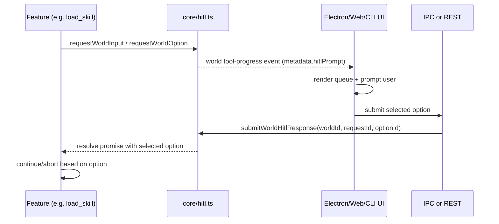

# HITL Approval Flow (Core, Electron, Web, CLI)

This document explains how Human-in-the-Loop (HITL) approval works in the current codebase.

## Purpose

HITL provides world-scoped human interaction gates for actions that require user confirmation or structured selection.
The public tool contract follows `llm-runtime`'s `ask_user_input` schema:

- `type?: "single-select" | "multiple-select"`
- `allowSkip?: boolean`
- `questions[]` with stable question and option IDs

Current policy:

- `ask_user_input` is the preferred public tool name.
- `human_intervention_request` remains only as a legacy alias of the same structured schema.
- System-enforced approvals (`create_agent`, `load_skill`) still use structured option prompts, but the host may add adjacent metadata for persistence and replay.
- Pending HITL no longer blocks a newer user turn in the same chat; a newer accepted user turn supersedes the older pending HITL request.
- `allowSkip` is honored only as an explicit skip capability. It does not mean the host should silently auto-skip or reinterpret supersession as a skip.

## Core Runtime

Primary implementation: `core/hitl.ts`.

## Route Separation

HITL interactions use two initiation routes that share the same runtime and client UI plumbing:

- System-enforced approval route:
  - initiated inside specific tools/features (`create_agent`, `load_skill`) via structured host helpers such as `requestWorldOption(...)`.
- LLM-initiated HITL route:
  - initiated by built-in `ask_user_input` (or the legacy alias `human_intervention_request`).

Both routes resolve through the same response API (`submitWorldHitlResponse`) and the same client queue/UI rendering.

### Data Model

- Structured request API: `requestWorldInput(world, { type, allowSkip, questions, ... })`
- Convenience wrapper for structured option approvals: `requestWorldOption(world, request)`
- Convenience response wrapper: `submitWorldOptionResponse({ worldId, requestId, optionId })`
- Shared response API: `submitWorldHitlResponse({ worldId, requestId, optionId?, answers?, skipped?, chatId? })`
- Pending requests are stored in-memory in a process-local map:
  - key: `worldId::requestId`
  - value includes selection mode, question IDs, option IDs, replay payload, resolver, and chat scope.

### Request Lifecycle

When a structured HITL request is created:

1. `type` defaults to `single-select` when omitted.
2. `allowSkip` defaults to `false` when omitted.
3. Questions and options are normalized with stable IDs.
2. `requestId` is resolved (provided or generated).
3. `chatId` is resolved from the explicit request or host context.
4. Pending entry is inserted into the map.
6. A world `tool-progress` event is emitted with payload:
  - `toolExecution.metadata.hitlPrompt` containing `requestId`, `type`, `allowSkip`, `questions[]`, and host metadata needed for replay.
7. The Promise remains pending until an explicit response is submitted.

### Resolution Lifecycle

When `submitWorldOptionResponse()` or `submitWorldHitlResponse()` is called:

1. Validates `worldId`, `requestId`, and either structured `answers`, `optionId`, or `skipped: true`.
2. Looks up pending request by `worldId::requestId`.
3. Validates chat scope, question IDs, option IDs, and skip eligibility.
4. Removes pending map entry.
5. Resolves requester promise with a structured result.

If the request was superseded by a newer user turn in the same chat, the response is rejected deterministically rather than treated as an active pending prompt.

### Replay on Chat Load

- When a chat is restored/loaded, unresolved HITL requests for that world/chat scope are replayed as `tool-progress` events containing `toolExecution.metadata.hitlPrompt`.
- Replay preserves original `requestId` so frontend responses resolve the original pending request.
- Replay is deterministic (stable order) and replay-only events are not re-persisted.
- Replay reconstruction accepts only structured `questions[]` HITL tool calls. Older flat `question/options` payloads are no longer reconstructed as active pending prompts.

## Where HITL Is Triggered Today

Current triggers in core include:

- `load_skill` performs a skill-level HITL gate before applying skill instructions.
- `create_agent` uses HITL for pre-create approval and post-create informational dismissal.
- Built-in `ask_user_input` allows LLMs to ask one or more structured choice questions.
  - The legacy alias `human_intervention_request` resolves to the same structured contract.
  - Free-text HITL mode is not part of the current runtime contract.

### `yes_once` vs `yes_in_session` (load_skill)

In `core/load-skill-tool.ts`, these options are handled differently:

- `yes_once`: approves only the current request and is not cached.
- `yes_in_session`: caches approval in-memory for the current runtime process.
- `no`: rejects the request and skill instructions are not loaded.

The cache key format is:

- `worldId::chatId::skillId`

That means approval is per-skill and scoped to world/chat context.

### Does approval apply to all skills?

No. Approval is not global.

- `yes_in_session` for one skill does not approve other skills.
- A different `skillId` requires its own HITL approval.

## Electron Flow

Relevant files:

- `electron/main-process/realtime-events.ts`
- `electron/main-process/message-serialization.ts`
- `electron/renderer/src/App.jsx`
- `electron/preload/bridge.ts`
- `electron/main-process/ipc-handlers.ts`
- `electron/shared/ipc-contracts.ts`

Flow:

1. Core emits world `tool-progress` event with `toolExecution.metadata.hitlPrompt`.
2. Electron main serializes and forwards as `chat:event` payload type `tool`.
3. Renderer subscription handler parses tool payload and enqueues prompt.
4. Inline HITL card is rendered in the message flow from queue (`hitlPromptQueue`).
5. User selects options or explicitly skips when `allowSkip` is true.
6. Renderer calls preload bridge `respondHitlOption(...)` or `respondHitlInput(...)`.
7. Main IPC handler delegates to `submitWorldHitlResponse(...)`.
8. Core resolves the request or rejects it deterministically if it was already superseded.

Invoke channel used for response:

- `hitl:respond` (`DESKTOP_INVOKE_CHANNELS.HITL_RESPOND`).

## Web Flow

Relevant files:

- `web/src/domain/hitl.ts`
- `web/src/pages/World.update.ts`
- `web/src/api.ts`
- `server/api.ts`

Flow:

1. Web receives `tool-progress` world event over SSE stream.
2. `parseHitlPromptFromToolEvent()` validates/enriches request payload from `toolExecution.metadata.hitlPrompt`.
3. Request is added to `hitlPromptQueue`.
4. User responds via inline HITL card with structured answers or skip when allowed.
5. Web calls `api.respondHitlOption(...)` or `api.respondHitlInput(...)`.
6. Server endpoint `POST /worlds/:worldName/hitl/respond` calls `submitWorldHitlResponse`.
7. Core resolves the request or returns a deterministic stale/superseded rejection.

## CLI Flow

Relevant files:

- `cli/hitl.ts`
- `cli/index.ts`

Flow:

1. CLI listens to world `tool-progress` events.
2. `parseHitlPromptFromToolEvent()` parses HITL requests.
3. Interactive mode:
  - prompts user to choose by index or option ID,
  - supports skip only when `allowSkip` is true,
  - submits via `submitWorldHitlResponse`.
4. Pipeline/non-interactive mode:
   - auto-submits deterministic default response to avoid blocking.

## End-to-End Sequence

```mermaid
sequenceDiagram
    participant Feature as Feature (e.g. load_skill)
    participant Core as core/hitl.ts
    participant Client as Electron/Web/CLI UI
    participant Bridge as IPC or REST

    Feature->>Core: requestWorldInput / requestWorldOption
    Core-->>Client: world tool-progress event (metadata.hitlPrompt)
    Client->>Client: render queue + prompt user
    Client->>Bridge: submit selected option
    Bridge->>Core: submitWorldHitlResponse(worldId, requestId, optionId)
    Core-->>Feature: resolve promise with selected option
    Feature->>Feature: continue/abort based on option
```

## Validation and Guardrails

- Option IDs are validated against pending request option set.
- Responses for unknown/expired `requestId` are rejected (`accepted: false`).
- `skipped: true` is accepted only when the request's `allowSkip` is true.
- Pending requests are durable in-process until explicit resolution.
- Scope is world-specific (`worldId::requestId`) to avoid cross-world collisions.
- Runtime is in-memory and process-local (not persisted across process restarts).
- Client-side replay/parser helpers now require structured `questions[]` payloads; legacy flat HITL argument normalization has been removed.

## Operational Notes

- Prompt visibility in clients depends on active event subscription for the target world/chat.
- Multiple pending requests are supported through unique `requestId` keys.
- A newer user turn in the same chat supersedes older pending HITL rather than silently skipping it.
- For new HITL use cases, prefer `requestWorldOption()` rather than ad-hoc approval events.
- Web and Electron composers no longer block sending a newer user turn just because HITL is pending.
