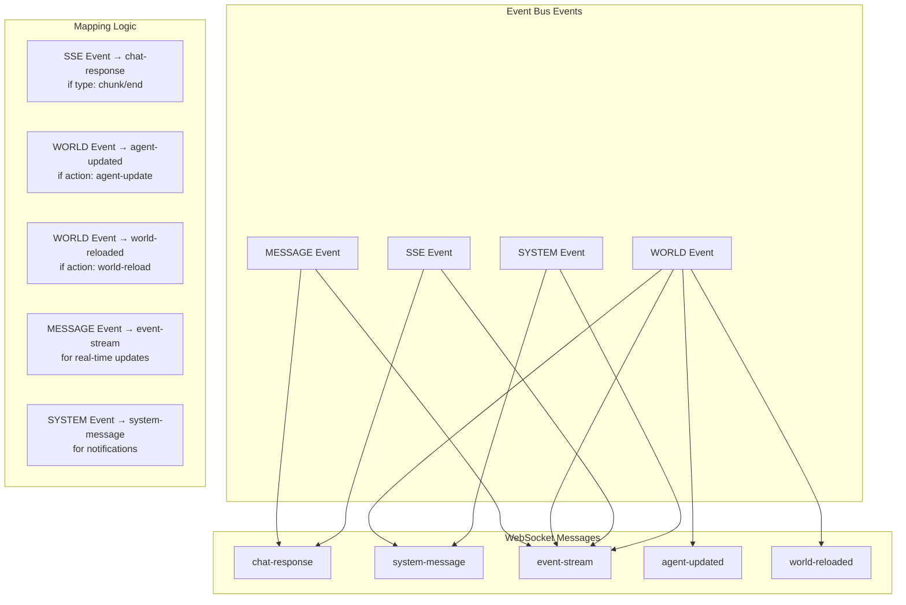
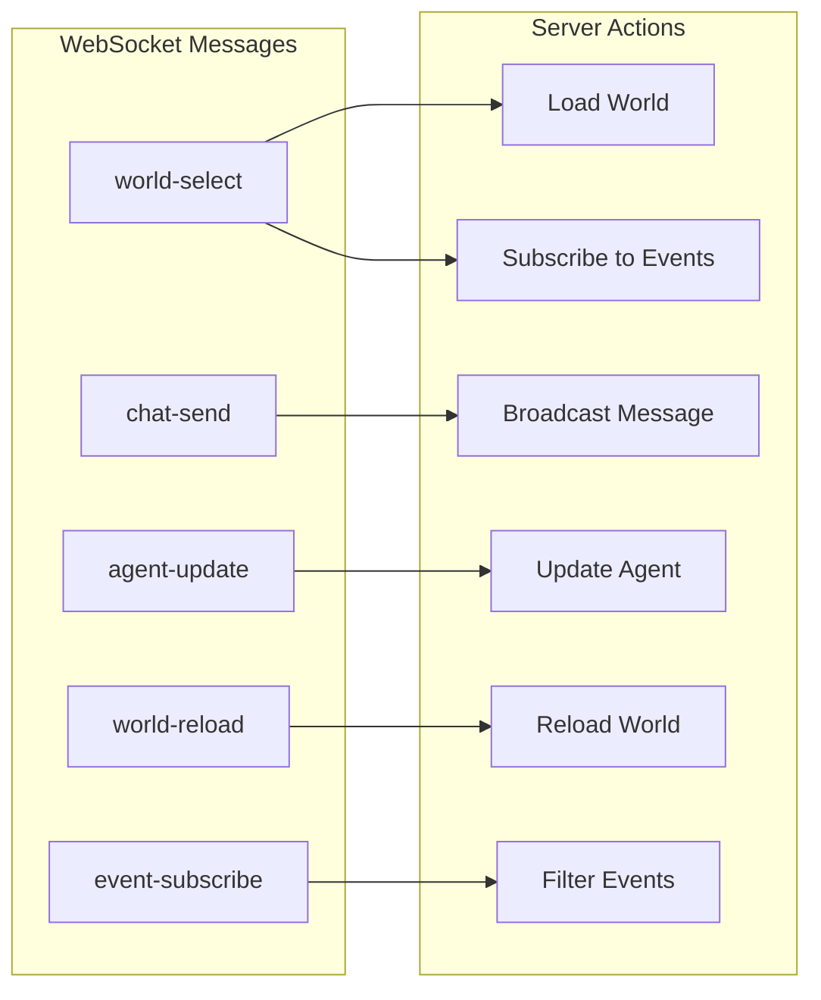
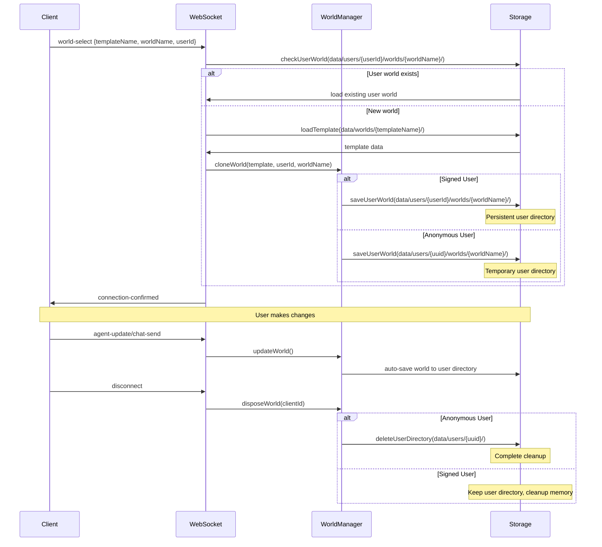

# WebSocket World Communication Requirements

## Overview
Add WebSocket support for private communication between server and client with world-specific event buses.

## Core Requirements

### Improved Folder Structure
```
data/
├── worlds/                          # Template worlds (read-only)
│   ├── default-world/
│   │   ├── config.json             # isTemplate: true
│   │   ├── agents/
│   │   └── ...
│   ├── extended-world/
│   │   ├── config.json             # isTemplate: true  
│   │   ├── agents/
│   │   └── ...
│   └── fast-world/
│       ├── config.json             # isTemplate: true
│       ├── agents/
│       └── ...
└── users/                          # User instances
    ├── john123/                    # Signed user
    │   └── worlds/
    │       ├── my-default-world/   # Cloned from default-world
    │       │   ├── config.json     # isTemplate: false
    │       │   ├── agents/
    │       │   └── ...
    │       ├── my-extended-world/  # Cloned from extended-world
    │       │   ├── config.json     # isTemplate: false
    │       │   ├── agents/
    │       │   └── ...
    │       └── custom-world-1/     # Custom creation
    │           ├── config.json     # isTemplate: false
    │           ├── agents/
    │           └── ...
    └── uuid-abc-456/               # Anonymous user
        └── worlds/
            └── temp-world/         # Temporary world
                ├── config.json     # isTemplate: false
                ├── agents/
                └── ...
```

### Benefits of User Folder Structure:
- **Multi-World Support**: Users can create/clone unlimited worlds
- **Clean Isolation**: Templates vs user data clearly separated
- **Simple Anonymous Handling**: Just delete user folder on disconnect
- **Scalability**: Easy to add user preferences, settings, backups
- **Data Portability**: Each user's data is self-contained

### 1. WebSocket Infrastructure
- **Private Communication**: Each client gets dedicated WebSocket connection
- **World Selection**: Client selects one world at a time via WebSocket
- **Connection Management**: Automatic cleanup on disconnect

### 2. World Cloning and User Sessions
- **Template System**: Original worlds in `data/worlds/` (read-only templates)
- **User Folders**: Each user gets `data/users/{userId}/worlds/` directory
- **Multi-World Support**: Users can clone/create multiple worlds
- **World Cloning**: Clone template to `data/users/{userId}/worlds/{worldName}/`
- **User Identification**: User ID in `world-select` message (UUID for anonymous)
- **Persistence Strategy**: 
  - Signed users: Auto-save to `data/users/{userId}/worlds/`
  - Anonymous users: Save to `data/users/{uuid}/worlds/`, delete folder on disconnect
- **Conflict Resolution**: Last edit wins

### 3. World-Specific Event Buses
- **Isolated Events**: Each world maintains separate event bus
- **Client Mapping**: Map WebSocket connections to specific worlds  
- **Event Routing**: Route world events only to connected clients

### 3. Client-Server Communication Flow
- **World Selection**: Client sends world selection via WebSocket
- **Message Submission**: User submits messages through WebSocket
- **Real-time Feedback**: Server streams responses back via WebSocket
- **Agent Updates**: Client sends agent data updates via WebSocket

### 4. Event Mapping
- **Server to Client**: Map system events, Messages, and SSE to WebSocket events
- **Event Types**:
  - `system` - System notifications
  - `message` - Agent/user messages
  - `streaming` - Real-time content streaming
  - `world-reload` - Trigger world reload

### 5. Client Response Handling
- **Streaming Content**: Display real-time streaming content
- **Server Messages**: Show agent responses and system messages
- **UI Updates**: Update interface based on WebSocket events

### 6. Connection Management
- **Event Cleanup**: Clear all event listeners on disconnect
- **World Reload**: Reload world when client updates agent data
- **One World Limit**: Enforce one world per client connection

## WebSocket Event and Message Definitions

### WebSocket Message Types (Client ↔ Server)

#### 1. Connection Messages
```typescript
// Client → Server: Select world for connection
interface WorldSelectMessage {
  type: 'world-select';
  payload: {
    templateName: string;     // Template world to clone from
    worldName: string;        // User's world instance name
    userId: string;           // Real user ID or client-generated UUID for anonymous
  };
}

// Server → Client: Connection confirmation
interface ConnectionConfirmedMessage {
  type: 'connection-confirmed';
  payload: {
    worldName: string;        // User's world instance name
    templateName: string;     // Original template name
    userId: string;          // User identifier
    userPath: string;        // data/users/{userId}/worlds/{worldName}/
    isTemplate: boolean;     // false for user instances
    isPersistent: boolean;   // true for signed users
    timestamp: string;
    clientId: string;
  };
}

// Server → Client: Connection error
interface ConnectionErrorMessage {
  type: 'connection-error';
  payload: {
    error: string;
    code: string;
  };
}
```

#### 2. Chat Messages
```typescript
// Client → Server: Send chat message
interface ChatSendMessage {
  type: 'chat-send';
  payload: {
    message: string;
    sender?: string; // defaults to "HUMAN"
  };
}

// Server → Client: Chat response (streaming)
interface ChatResponseMessage {
  type: 'chat-response';
  payload: {
    agentName: string;
    content: string;
    messageId: string;
    isComplete: boolean;
    usage?: {
      inputTokens: number;
      outputTokens: number;
      totalTokens: number;
    };
  };
}

// Server → Client: System message
interface SystemMessage {
  type: 'system-message';
  payload: {
    content: string;
    level: 'info' | 'warning' | 'error';
    timestamp: string;
  };
}
```

#### 3. Agent Management Messages
```typescript
// Client → Server: Update agent
interface AgentUpdateMessage {
  type: 'agent-update';
  payload: {
    agentName: string;
    updates: {
      status?: 'active' | 'inactive';
      config?: Record<string, any>;
      systemPrompt?: string;
      clearMemory?: boolean;
    };
  };
}

// Server → Client: Agent updated confirmation
interface AgentUpdatedMessage {
  type: 'agent-updated';
  payload: {
    agentName: string;
    agent: Agent;
  };
}

// Client → Server: Request world reload
interface WorldReloadMessage {
  type: 'world-reload';
  payload: {
    reason?: string;
  };
}

// Server → Client: World reloaded confirmation
interface WorldReloadedMessage {
  type: 'world-reloaded';
  payload: {
    worldName: string;
    agentCount: number;
    timestamp: string;
  };
}
```

#### 4. Event Stream Messages
```typescript
// Server → Client: Real-time event stream
interface EventStreamMessage {
  type: 'event-stream';
  payload: {
    eventType: 'message' | 'world' | 'sse' | 'system';
    event: Event; // From existing Event interface
  };
}

// Client → Server: Subscribe to specific events
interface EventSubscribeMessage {
  type: 'event-subscribe';
  payload: {
    eventTypes?: string[];
    agentName?: string;
  };
}
```

### Server-Side Event Mapping

#### Event Bus → WebSocket Mapping


#### WebSocket → Server Action Mapping


### Event Mapping Implementation Strategy

#### 1. Server Event → WebSocket Message Mapping
```typescript
interface EventToWebSocketMapper {
  MESSAGE: (event: Event) => ChatResponseMessage | EventStreamMessage;
  WORLD: (event: Event) => SystemMessage | AgentUpdatedMessage | WorldReloadedMessage | EventStreamMessage;
  SSE: (event: Event) => ChatResponseMessage | EventStreamMessage;
  SYSTEM: (event: Event) => SystemMessage | EventStreamMessage;
}
```

#### 2. WebSocket Message → Server Action Mapping
```typescript
interface WebSocketToActionMapper {
  'world-select': (payload: any) => Promise<void>;
  'chat-send': (payload: any) => Promise<void>;
  'agent-update': (payload: any) => Promise<void>;
  'world-reload': (payload: any) => Promise<void>;
  'event-subscribe': (payload: any) => Promise<void>;
}
```

### Connection Flow Diagram


## Technical Constraints
- Use existing event bus architecture
- Maintain compatibility with current REST API
- Function-based approach (no classes)
- TypeScript with proper typing
- Real-time bidirectional communication
- World-specific event isolation
- Automatic cleanup on disconnect
- Template worlds in `data/worlds/` are read-only (`isTemplate: true` in config)
- User worlds in `data/users/{userId}/worlds/` auto-save on every change
- Anonymous users get temporary `data/users/{uuid}/` directories (deleted on disconnect)
- Last edit wins conflict resolution
- No caching - load templates fresh each time
- Multi-world support per user
